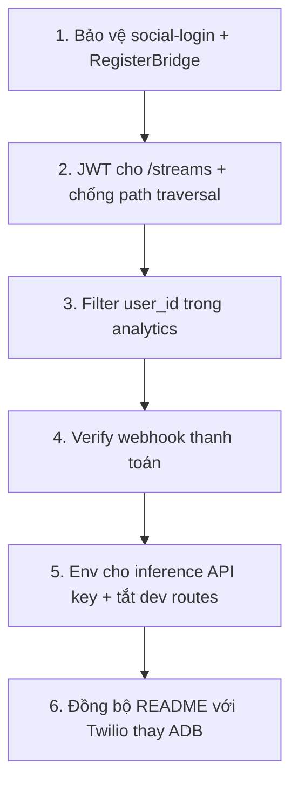

# Code Review — Cardiac Alert System (CAS)

> Rà soát toàn bộ codebase: backend Go, frontend Next.js, Python AI, ai-brain, mobile, bảo mật và vận hành.  
> Cập nhật: 08/06/2026

---

## Tổng quan

Cardiac Alert là hệ thống đa tầng (Go API, Next.js, Python AI, ai-brain) với luồng chính hợp lý:

**Camera → inference.py → `POST /api/v1/ai-result` → Alert Engine → Telegram / Twilio / WebSocket → MongoDB**

Phần lớn private route đã có JWT; ownership camera được kiểm tra ở nhiều chỗ (`AddCamera`, `DeleteCamera`, `SimulateAI`). WebSocket hub broadcast theo `UserID` — đúng hướng privacy.

---

## Critical — cần xử lý trước

### 1. `social-login` không xác thực OAuth thật

**File:** `go-backend/internal/auth/handler.go`

Endpoint `POST /api/v1/auth/social-login` là **công khai**. Bất kỳ ai cũng có thể gửi `provider_id` giả và nhận JWT hợp lệ, bỏ qua Google/Facebook.

NextAuth gọi endpoint này sau OAuth, nhưng attacker có thể gọi trực tiếp.

**Khuyến nghị:**
- Chỉ cho phép gọi từ Next.js server (shared secret / internal header).
- Hoặc verify OAuth token phía backend trước khi cấp JWT.

---

### 2. `RegisterBridge` không có auth

**File:** `go-backend/internal/camera/api.go` — `RegisterBridge`

Route `POST /api/v1/bridge/register` là **public**. Biết `user_id` là có thể ghi đè cấu hình camera bridge của người khác.

**Khuyến nghị:**
- Yêu cầu JWT + kiểm tra `user_id` trùng token.
- Hoặc dùng bridge secret riêng (mỗi user/device một key).

---

### 3. Analytics không lọc theo user (data leak multi-tenant)

**File:** `go-backend/internal/analytics/api.go`

`GetSummary` và `GetTimeline` đếm/query toàn bộ collection `events` và `cameras` **không filter `user_id`**.

Mọi user đăng nhập đều thấy thống kê của **toàn hệ thống** — lỗi horizontal data leak. Trong khi `GetIncidents` đã filter `user_id` đúng.

**Khuyến nghị:**
- Thêm `user_id` từ JWT vào mọi query analytics.
- `active_cameras` chỉ đếm camera của user hiện tại.

---

### 4. HLS stream không được bảo vệ

**File:** `go-backend/main.go`

```go
r.GET("/streams/*filepath", func(c *gin.Context) {
    c.File(filepath.Join(hlsServer.OutputDir, c.Param("filepath")))
})
```

README ghi *"Secure HLS với JWT"*, nhưng route **không** dùng `JWTMiddleware`. JWT middleware có hỗ trợ `?token=` cho `/streams`, nhưng route thực tế không áp dụng middleware đó.

**Hệ quả:** Ai biết URL `/streams/<camera_id>/index.m3u8` có thể xem live stream.

**Khuyến nghị:**
- Bọc route bằng `auth.JWTMiddleware()`.
- Kiểm tra user sở hữu camera tương ứng với segment path.

---

### 5. Path traversal tiềm ẩn trên `/streams/`

**File:** `go-backend/main.go`

`filepath.Join(OutputDir, userInput)` không validate path nằm trong `OutputDir`. Request kiểu `/streams/../../secret` có thể đọc file ngoài thư mục stream.

**Khuyến nghị:**
```go
fullPath := filepath.Join(hlsServer.OutputDir, filepath.Clean("/"+c.Param("filepath")))
if !strings.HasPrefix(fullPath, filepath.Clean(hlsServer.OutputDir)) {
    c.AbortWithStatus(403)
    return
}
```

---

## High — ảnh hưởng chức năng / bảo mật

### 6. Telephony ADB đã bị gỡ — báo động cục bộ gần như không hoạt động

**File:** `go-backend/internal/telephony/android.go`

`InitiateAndroidCall` và `TriggerLocalAlarm` chỉ log cảnh báo — tích hợp ADB đã bị loại bỏ. Chỉ Twilio hoạt động nếu đã cấu hình.

Engine vẫn gọi các hàm này trong `Process` và `triggerAlert`, nhưng không có tác dụng thực tế nếu không có Twilio.

**README vẫn mô tả ADB là thành phần cốt lõi** — tài liệu và code lệch nhau.

---

### 7. Webhook thanh toán không verify chữ ký

**File:** `go-backend/internal/payment/handler.go` — `SePayWebhook`

Parse nội dung chuyển khoản nhưng **không xác minh signature/API key** từ SePay. Có thể POST giả webhook để nâng gói.

**Khuyến nghị:** Verify SePay webhook signature theo tài liệu SePay.

---

### 8. `AIResult` — có API key nhưng không kiểm tra camera hợp lệ

**File:** `go-backend/internal/alert/api.go` — `AIResult`

Chỉ cần `INTERNAL_API_KEY` + `CameraID` hợp lệ (ObjectID) là có thể kích hoạt báo động cho **camera bất kỳ**, kể cả của user khác.

**Khuyến nghị:**
- Verify camera tồn tại trong DB.
- Tùy chọn: chỉ chấp nhận camera đang `online`.

---

### 9. Secret hardcode trong `inference.py`

**File:** `inference.py`

```python
headers = {"X-API-Key": "ai_secret_key_12345"}
```

API key nằm trong source thay vì đọc từ biến môi trường — dễ lộ khi commit/public repo.

**Khuyến nghị:**
```python
headers = {"X-API-Key": os.getenv("INTERNAL_API_KEY", "")}
```

---

### 10. NextAuth cho login khi backend fail

**File:** `web-app/src/app/api/auth/[...nextauth]/route.ts`

```typescript
} catch (error) {
  console.error("Lỗi đồng bộ Auth với Backend:", error);
}
return true;  // ← luôn cho phép login
```

`signIn` luôn `return true` dù backend không trả token → session OAuth tồn tại nhưng `accessToken` rỗng, các API backend fail im lặng.

**Khuyến nghị:** `return false` khi backend không trả `data.token`.

---

### 11. Route demo nguy hiểm trên production

| Route | Rủi ro |
|-------|--------|
| `POST /api/v1/test-call` | Gọi khẩn cấp thật qua Twilio |
| `POST /api/v1/cameras/:id/simulate-ai` | Kích hoạt full pipeline báo động |
| `POST /api/v1/user/simulate-payment` | Nâng gói không qua thanh toán |

Có JWT nhưng **mọi user đăng nhập** đều dùng được.

**Khuyến nghị:** Guard bằng env `ENABLE_DEV_ROUTES=false` trên production.

---

## Medium — chất lượng / độ tin cậy

### 12. `ai-brain` crash khi vector DB rỗng

**File:** `ai-brain/service.py`

```python
context_docs = results['documents'][0]
```

Collection rỗng → `IndexError`. ChatBot báo lỗi cho user mới chưa có incident.

**Khuyến nghị:** Kiểm tra `if not context_docs:` trước khi join; trả fallback message.

---

### 13. Bug scope trong `inference.py`

**File:** `inference.py` — `_poll_model_status`

Vòng `for m in models` nằm **ngoài** `if res.status_code == 200`. Request fail → `NameError: models`.

**Khuyến nghị:** Di chuyển vòng lặp vào trong block `if res.status_code == 200`, hoặc `continue` khi fail.

---

### 14. Bằng chứng sự cố là placeholder

**File:** `go-backend/internal/alert/engine.go`

- Engine dùng `audio/mockup.png` cố định cho Telegram và cloud sync.
- `HLSServer.ArchiveIncident` có code nhưng **không được gọi** từ engine.
- `cloud.SyncManager.UploadIncidentEvidence` chỉ mock log, không upload thật.

---

### 15. `NEXTAUTH_SECRET` fallback yếu

**File:** `web-app/src/app/api/auth/[...nextauth]/route.ts`

```typescript
secret: process.env.NEXTAUTH_SECRET || "your_secret_key",
```

Production không nên có fallback cứng.

---

### 16. Endpoint công khai không cần thiết / lộ thông tin

| Endpoint | Rủi ro |
|----------|--------|
| `GET /swagger/*` | Lộ toàn bộ API surface |
| `GET /metrics` | Lộ metric hệ thống |
| `GET /api/v1/ai-models` | Lộ cấu hình model (cần cho script AI) |
| `Static /audio` | Có thể lộ file alert |

---

### 17. JWT callback gọi backend mỗi lần refresh token

**File:** `web-app/src/app/api/auth/[...nextauth]/route.ts`

Mỗi `jwt()` callback fetch `/health-profiles` — tải backend cao, có thể chậm login.

**Khuyến nghị:** Chỉ fetch khi `trigger === "signIn"` hoặc cache TTL ngắn.

---

### 18. Rate limit 60 req/phút/IP

**File:** `go-backend/main.go`

- Dashboard + analytics + polling dễ chạm 429.
- Limiter in-memory, reset mỗi phút — không scale multi-instance.

---

### 19. URL nội bộ cứng

**Files:** `go-backend/internal/alert/api.go`, `engine.go`

`AIChat` và engine gọi `http://localhost:8001` (có fallback env `AI_BRAIN_URL` ở engine, chưa đồng nhất ở `AIChat`).

Triển khai tách máy cần env `AI_BRAIN_URL` thống nhất.

---

### 20. CORS chỉ whitelist localhost

**File:** `go-backend/main.go`

Mặc định: `localhost:3000`, `127.0.0.1:3000`. Có hỗ trợ `FRONTEND_URL` env nhưng production cần cấu hình đúng.

---

### 21. `inference.py` — auto-detect camera ID fail

Gọi `GET /api/v1/cameras` không kèm JWT → thường trả **401**.

**Khuyến nghị:** Luôn dùng `--camera_id <id>` hoặc đọc từ env.

---

### 22. Docker Compose thiếu AI services

**File:** `docker-compose.yml`

Chỉ có: MongoDB, Redis, backend, web-app. Không có `ai-brain` / `inference.py`.

README nói `docker-compose up` nhưng AI pipeline vẫn phải chạy thủ công.

---

## Low — cải thiện nên có

| # | Vấn đề | File |
|---|--------|------|
| 23 | Engine `Process` query MongoDB lặp 3–4 lần mỗi frame nghi vấn | `engine.go` |
| 24 | `http.Post` fire-and-forget index vector — không log lỗi | `engine.go` |
| 25 | `GetIncidents` không sort/pagination | `alert/api.go` |
| 26 | Mobile đọc `created_at`, web đọc `detected_at` — nên thống nhất schema | `incidents/page.tsx`, mobile |
| 27 | `CheckPayment` public — OK cho polling nhưng có thể brute-force mã ngắn | `user/handler.go` |
| 28 | JWT trong query string cho WebSocket — có thể lộ qua log/referrer | `useDashboardSocket.ts` |
| 29 | `SimulateAI` dùng model name khác DB (`Fall Detection Engine (Simulation)`) — may mắn bypass model check | `alert/api.go` |

---

## Đã sửa / điểm tốt

| Mục | Trạng thái |
|-----|-----------|
| `POST /api/v1/ai-result` đăng ký trong `main.go` | ✅ Đã sửa |
| `execADB` đọc `ADB_PATH` từ env | ✅ Đã sửa (endpoint ADB debug đã gỡ khỏi routes) |
| JWT middleware bắt buộc `JWT_SECRET` | ✅ Panic nếu thiếu |
| WebSocket hub broadcast theo `UserID` | ✅ Đúng |
| `SimulateAI` kiểm tra ownership camera | ✅ Đúng |
| Engine lưu event đầy đủ (`detected_at`, `confidence_score`, `camera_name`) | ✅ Đúng |
| `GetIncidents` filter theo `user_id` | ✅ Đúng |
| Camera CRUD kiểm tra ownership + plan limit | ✅ Đúng |
| `AIResult` xác thực `X-API-Key` | ✅ Đúng (thiếu validate camera) |
| `ai-brain` tích hợp Gemini 2.5 | ✅ Có (cần `GEMINI_API_KEY`) |

---

## Ưu tiên sửa (thứ tự đề xuất)



| # | Việc | Effort ước tính |
|---|------|-----------------|
| 1 | Auth `social-login` + `RegisterBridge` | ~2h |
| 2 | JWT middleware + `filepath.Clean` cho `/streams` | ~1h |
| 3 | `user_id` filter trong analytics | ~30 phút |
| 4 | SePay signature verification | ~1h |
| 5 | `INTERNAL_API_KEY` từ env trong `inference.py` | ~15 phút |
| 6 | `ENABLE_DEV_ROUTES` guard cho test/simulate | ~30 phút |
| 7 | Fix `ai-brain` empty collection + `inference.py` scope bug | ~30 phút |
| 8 | NextAuth `return false` khi backend fail | ~15 phút |
| 9 | Cập nhật README (ADB → Twilio, HLS security thực tế) | ~30 phút |

---

## Phụ lục: Bảng route nhạy cảm

| Method | Route | Auth | Ghi chú |
|--------|-------|------|---------|
| POST | `/api/v1/auth/social-login` | ❌ Public | **Critical** — forge JWT |
| POST | `/api/v1/bridge/register` | ❌ Public | **Critical** — hijack camera |
| POST | `/api/v1/ai-result` | X-API-Key | Thiếu validate camera |
| POST | `/api/v1/payment/webhook` | ❌ Public | Thiếu signature |
| GET | `/streams/*` | ❌ Public | **Critical** — lộ video |
| GET | `/api/v1/analytics/*` | JWT | **Critical** — leak cross-user |
| POST | `/api/v1/test-call` | JWT | Dev only |
| POST | `/api/v1/cameras/:id/simulate-ai` | JWT + ownership | Dev only |
| POST | `/api/v1/user/simulate-payment` | JWT | Dev only |
| GET | `/api/v1/user/check-payment` | ❌ Public | Polling mã thanh toán |
| GET | `/api/v1/ai-models` | JWT hoặc X-API-Key | OK cho script AI |
| GET | `/ws` | JWT (query/header) | ✅ |
| GET | `/swagger/*`, `/metrics` | ❌ Public | Nên tắt production |

---

## Phụ lục: Luồng báo động (tham chiếu)

```
inference.py (conf > 0.85, label != normal)
    │
    ▼
POST /api/v1/ai-result  [X-API-Key]
    │
    ▼
Engine.ResultCh → Process()
    │
    ├─ 0s:  SuspectStart → Telegram "THEO DÕI"
    ├─ 7s:  TriggerLocalAlarm (ADB đã gỡ) + WebSocket local_warning
    └─ 10s: triggerAlert()
              ├─ Telegram khẩn cấp + ảnh mockup.png
              ├─ InitiateAndroidCall → Twilio (nếu cấu hình)
              ├─ Insert MongoDB events
              └─ POST ai-brain /index
```

---

*Tài liệu này được tạo từ rà soát code thủ công. Khi sửa từng mục, cập nhật trạng thái tương ứng trong bảng "Đã sửa / điểm tốt".*
