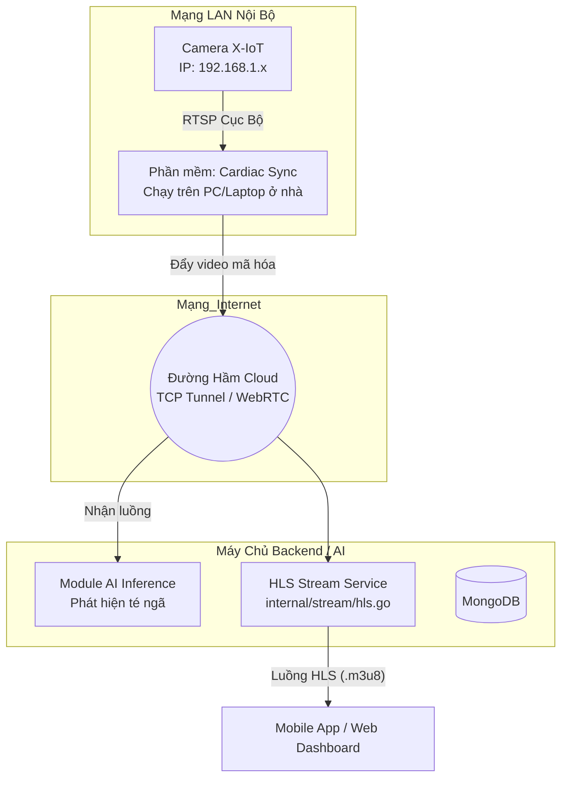

# Kế Hoạch Tích Hợp Camera X-IoT bằng Phần Mềm "Cầu Nối" (Bridge)

Tài liệu này mô tả giải pháp kỹ thuật nhằm đưa luồng video từ các dòng camera nội bộ giá rẻ (X-IoT) lên máy chủ Cardiac Alert Cloud mà **không cần mở Port (Port Forwarding)**, giữ cho trải nghiệm người dùng cuối ở mức đơn giản nhất.

## 1. Kiến Trúc Tổng Thể (Bridge Architecture)

Vấn đề cốt lõi: Camera X-IoT và Máy chủ chạy AI nằm ở 2 mạng lưới khác nhau. Máy chủ không thể gọi thẳng vào Camera.
Giải pháp: Sử dụng một phần mềm "Cầu nối" (Bridge App) chạy ngay tại nhà người dùng để chủ động bơm (push) luồng video lên Cloud.

## 2. Giải pháp Phần mềm Cầu Nối (Cardiac Sync Tool)

Để người dùng "không biết code" vẫn dùng được, dự án sẽ đóng gói một phần mềm nhỏ (dạng file `.exe` cho Windows). Phần mềm này thực chất là việc kết hợp lõi của tool mã nguồn mở **`go2rtc`** và **`Ngrok`** (hoặc Cloudflare Tunnel).

### Trải nghiệm người dùng (UX)
1. **Cài đặt camera:** Khách hàng cài camera X-IoT vào wifi bằng app của hãng.
2. **Khởi động Cầu nối:** Khách hàng tải file `Cardiac_Sync.exe` về máy tính/laptop ở nhà. Mở lên và bấm 1 nút duy nhất **"Bắt đầu đồng bộ"**.
3. **Thêm vào App:** Khách hàng mở app Cardiac Alert trên điện thoại di động, App sẽ tự động nhận diện phần mềm Sync và lấy luồng camera thành công.

### Cơ chế hoạt động của phần mềm Bridge (Dưới nền)
1. **Auto-Discovery:** Khi phần mềm chạy, nó dùng lệnh quét LAN để tìm ra IP của camera X-IoT.
2. **Tạo Tunnel:** Nó tự động kích hoạt một đường hầm mạng (Tunnel) tới Máy chủ của Cardiac Alert.
3. **Restream:** Nó sử dụng engine của `go2rtc` để đọc luồng RTSP chậm chạp của X-IoT, tối ưu hóa và bơm lên đường hầm mạng kia.

## 3. Các thành phần cần Code trong dự án

Để hiện thực hóa mô hình này, Team cần cập nhật các module sau trong hệ thống hiện tại:

### A. Xây dựng "Cardiac Sync Tool" (Tool độc lập)
- Viết bằng Golang (hoặc Python).
- Tích hợp `go2rtc` binary vào bên trong.
- **Tính năng:** Khi chạy, tool gọi API POST `https://api.cardiac-alert.com/v1/bridge/register` để báo cáo trạng thái "Đang online" kèm theo cái URL của Tunnel.

### B. Cập nhật Go Backend (`internal/stream` & `internal/alert`)
- Sửa đổi logic để không cố kết nối vào `rtsp://192.168.x.x` nữa.
- Lưu URL của Bridge (do phần mềm Sync gửi lên) vào cấu hình Camera của người dùng (`UserDoc` trong MongoDB).
- Truyền URL này vào Module AI (đang xử lý logic tại `android_gateway.go` / `hls.go`) để làm đầu vào hình ảnh.

### C. Cập nhật Mobile App (`AddCameraModal.tsx`)
- Thêm màn hình hướng dẫn: *"Vui lòng mở phần mềm Cardiac Sync trên máy tính của bạn"*.
- Giao diện chuyển sang trạng thái Loading chờ phần mềm ở nhà ping lên Server.
- Khi nhận được tín hiệu, tự động lấp đầy cấu hình camera mà không cần người dùng nhập IP/Port.

## 4. Lộ trình thực hiện (Roadmap)

1. **Giai đoạn Test kỹ thuật:** Dùng thử `go2rtc` và `ngrok` chạy bằng lệnh terminal ở máy local để đưa luồng cam X-IoT lên mạng internet. Đưa link đó vào Dashboard xem có bị trễ (latency) không.
2. **Giai đoạn Đóng gói:** Code một tool Golang nhỏ tự động hóa việc chạy 2 lệnh trên, build ra file `.exe` để người dùng dễ click.
3. **Giai đoạn Tích hợp App:** Chỉnh sửa giao diện `AddCameraModal.tsx` và Backend để giao tiếp với Tool này.

> **Lưu ý Vận hành:** Khi dùng tool làm cầu nối trên máy tính, máy tính của người nhà bệnh nhân bắt buộc phải **Bật 24/24** thì luồng camera mới truyền đi được. Về dài hạn (Phase 2), dự án nên chuyển tool phần mềm này sang một thiết bị phần cứng nhỏ (Mini Box) bán kèm camera để cắm điện liên tục, tránh phụ thuộc vào máy tính cá nhân.
