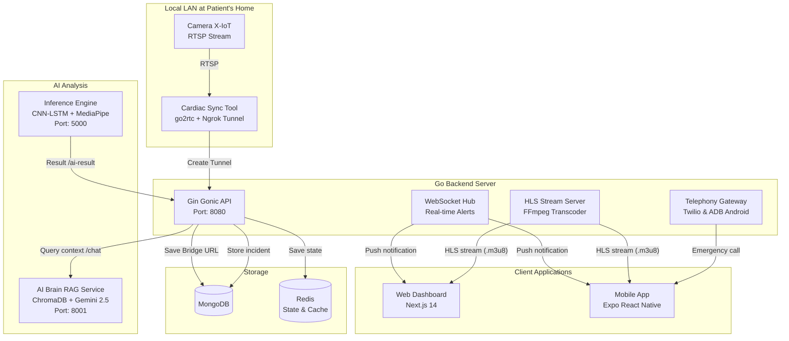

lưu ý tìm lỗi kì rồi sửa k xoá bất kì các mục khác nào 
tìm hiểu kĩ mới làm k làm hời hợt qua chuyện

# 🏥 Cardiac Alert System (CAS) - Comprehensive Technical Documentation

The **Cardiac Alert System (CAS)** is a smart medical monitoring ecosystem integrated with Artificial Intelligence (AI) to detect falls and seizures in real-time. It supports multi-channel alerts to protect the health of the elderly and cardiac patients.

The system is multi-platform, consisting of a **Web Dashboard (Next.js)**, a **Mobile App (Expo React Native)**, a high-performance **Go Backend**, and an **AI Hub** that analyzes video feeds from RTSP streams or local Webcams.

---

## 🗺️ 1. System Architecture

The interaction between the components is shown in the diagram below:



### 🔌 Default Service Ports

| Service | Default Port | Main Role |
| :--- | :--- | :--- |
| **Go Backend** | `8080` | Handles the main API, WebSocket `/ws`, and HLS Stream `/streams` |
| **AI Inference** | `5000` | Run fall detection on video feeds, stream virtual MJPEG `/video_feed` |
| **AI Brain** | `8001` | FastAPI RAG service using ChromaDB and Gemini 2.5 Flash Lite |
| **gRPC AI Service** | `5051` | Internal API for keypoint sequence analysis via gRPC |
| **Next.js Web App**| `3000` | Management dashboard for settings, camera feeds, and health monitoring |
| **Expo Go** | `8081` | Dev Server for the React Native mobile app |

---

## 📂 2. Directory Structure & Detailed Functions

The project is organized in a clear modular structure, split by technology stack:

### 🔹 A. Go Backend (`go-backend/`)
Powered by the **Gin Gonic** framework, integrated with **MongoDB** for configuration storage, and **Redis** for camera session states.

*   `main.go`: Entry point of the system. Configures secure CORS Middleware, custom Rate Limiter (maximum 60 requests/minute per IP), registers public/private API routes, and initializes background tasks.
*   `internal/auth/`:
    *   `jwt.go`: JWT Authentication Middleware. Upgraded to strictly validate the claim type of `userID` (must be `string`) to prevent runtime type-assertion panic errors.
*   `internal/alert/`:
    *   `engine.go`: The core alert engine. Receives AI inference results. If a suspected fall state is detected for 7 seconds, it triggers a local warning alarm on the Android gateway. If it persists past 10 seconds, it triggers an Emergency Alert: registers the incident in MongoDB, sends Telegram bot notifications, uploads evidence frames, executes outbound emergency phone calls, and indexes the incident text into the AI Vector DB.
    *   `api.go`: Registers endpoints: `/api/v1/ai-result` (requires `INTERNAL_API_KEY`), `/api/v1/incidents` (fetch logs for a user), `/api/v1/ai/chat` (proxy requests to the RAG service), and `/api/v1/test-call`.
    *   `storage.go`: `StateStorage` interface for camera states. Supports **Redis** or a thread-safe in-memory fallback **MemoryStorage** protected by `sync.RWMutex` to eliminate Data Race conditions.
*   `internal/camera/`:
    *   `manager.go`: Manages camera streaming life-cycles. On backend startup, it automatically spawns FFmpeg subprocesses to transcode active camera RTSP streams to HLS.
    *   `api.go`: Camera CRUD operations. Enforces resource ownership checking to prevent unauthorized access or privilege escalation (Horizontal Privilege Escalation).
*   `internal/stream/`:
    *   `hls.go`: Manages the static HLS streaming directory and FFmpeg subprocesses. Includes an automated cleaner that deletes segments older than 1 hour, and archives 2-minute video segments surrounding a fall incident (Evidence Archiving) to `/storage/archives/`.
*   `internal/telephony/`:
    *   `android.go`: Gateway connecting to a physical Android device via USB using **ADB (Android Debug Bridge)**.
        *   Automatically detects connected devices using `adb devices`.
        *   Triggers phone calls via Android Intent: `am start -a android.intent.action.CALL -d tel:<phone>`.
        *   Detects if the call is answered by monitoring `dumpsys telephony.registry` for the state `mForegroundCallState=4` (Active).
        *   Pushes local alarm audio to the phone via `adb push` and triggers playback through a foreground application service (`com.cardiac.alert/.AlertService`).
        *   Supports Local Warning speech announcements directly from the device speaker.
    *   `telegram.go`: Telegram Bot client that sends detailed textual alerts, interactive buttons (Acknowledge, First Aid Guide, Redial), and screenshot evidence. Toggles update listener routines (Ack updates).
*   `internal/ws/`:
    *   `hub.go` & `client.go`: WebSocket real-time connection hub. Upgraded to structure clients into `map[string]map[*Client]bool` grouped by `UserID` to optimize broadcasts to $O(1)$ lookups instead of scanning global arrays.

### 🔹 B. AI Hub & Inference Engine (`inference.py` & `ai-service/`)
*   `inference.py`: Python runtime script executing real-time computer vision inference.
    *   Uses **MediaPipe Pose Landmarker** to extract 33 skeletal landmarks (99 coordinates x, y, z) at 30 FPS.
    *   Uses a **CNN + LSTM** deep learning model (`models/best_model.pth`) to classify posture labels: `fall`, `normal`, `ngoi` (sitting), `di ngu` (lying down/sleeping).
    *   **Three-State Machine** logic:
        1.  `monitoring`: Standard monitoring. If a fall label is detected for 8 consecutive frames (or just 3 frames if the spinal angle drops suddenly from <25° to >60°), it enters `fall_detected`.
        2.  `fall_detected`: Waits 10 seconds to detect if the patient stands back up (recovery count). If they remain down, it triggers local voice alerts and transitions to `post_fall`.
        3.  `post_fall`: Continuously posts emergency events to `/api/v1/ai-result`. Analyzes skeletal movement variance to distinguish between a seizure (`seizure` - high variance) and unconsciousness (`unconscious` - zero variance).
    *   Integrated **YOLOv11-Nano Furniture Detector**: If the model detects that the patient's hip overlaps with furniture (bed, couch, chair), it suppresses the fall alarm (classifies it as resting/sleeping) to prevent false alerts.
    *   Exposes a 0ms-latency virtual MJPEG video stream on `http://localhost:5000/video_feed`.
*   `ai-service/`:
    *   `grpc_server.py` & `main.py`: Secondary API wrapper services using FastAPI and gRPC to analyze a list of 30 skeletal keypoint frames remotely.

### 🔹 C. AI Brain RAG Service (`ai-brain/`)
A semantic search and Q&A engine to query medical data and incident history.
*   `service.py`: FastAPI server running on port `8001`.
    *   Uses local vector database **ChromaDB** to index incident logs using `all-MiniLM-L6-v2` embeddings.
    *   Connects to **Gemini 2.5 Flash Lite** API. Gathers matching vector records from ChromaDB, constructs a system prompt with strict tech-privacy rules, and returns polite, structured Vietnamese responses.
*   `seed_data.py` & `init_db_knowledge.py`: Seeds initial vector documents regarding CPR first aid, bot control guides, and standard procedures.

### 🔹 D. Web App (`web-app/`)
Next.js 14 (TypeScript) dashboard utilizing Modern App Router patterns.
*   Dashboard grid showing live-monitoring cards for all cameras.
*   Enforces secure HLS streaming with JWT validation passed via query parameters (`/streams/.../stream.m3u8?token=...`).
*   Config page (`settings/page.tsx`) to edit patient health details, emergency numbers, alert parameters (`thrLow`, `thrHigh`), and Telegram Chat IDs.
*   Interactive RAG chatbot widget querying the `ai-brain` service for first aid instruction and patient history.
*   WebSocket listener that turns the UI borders red and flashes alerts on the client instantenously when a fall occurs.

### 🔹 E. Mobile App (`mobile-app/`)
Expo-based React Native mobile application for relatives.
*   Uses **Zustand** to persist user session tokens.
*   WebSocket context listener for push notifications.
*   Tab screens for: Home (Overview), Cameras, Incident Logs, CPR Guidelines (First Aid), and Profile (Emergency Contacts).

---

## ⚡ 3. Posture Detection & Alert Workflow

The sequence of events from when a patient falls until the emergency pipeline is triggered:

```
[Patient stands normally]
       │
       ▼ (Sudden fall event)
[AI detects 'fall' label (Confidence > 85%)] ──(Sudden spinal drop)──► Lower threshold for instant response
       │
       ▼ (Lying down for 7 consecutive seconds)
[Backend registers Suspect state] ──► Triggers local audio warning (via Android device speaker)
       │                           ──► Broadcasts 'local_warning' event via WebSocket to Web/Mobile
       │
       ▼ (Lying down reaches 10 seconds)
[Emergency Alert Pipeline Triggered]
       │
       ├─► 1. Send detailed incident log and patient medical file to Telegram Bot group.
       ├─► 2. Upload and attach captured screenshot evidence frame to the Telegram message.
       ├─► 3. Execute emergency call via Twilio Cloud or Android ADB Gateway (physical SIM).
       ├─► 4. Once the call state is ACTIVE (answered), play TTS synthesized voice alerts.
       ├─► 5. Archive the 2-minute video segment to permanent storage (/storage/archives/).
       ├─► 6. Save incident document to MongoDB and index the text into ChromaDB (AI Brain RAG).
       │
       ▼ (Relative receives alert on Telegram Bot)
[Relative interacts with Telegram Bot buttons]
       ├─► 'Deactivate' button: Silences alarms, stops repeating alert cycles.
       └─► 'First Aid Guide' button: Bot prints CPR guide and opens a chat conversation.
```

---

## 🔒 4. Security System & Implemented Bug Fixes

According to the historical review audit cycles (Code Review 1-5), the following vulnerabilities have been successfully hardened:

1.  **Race Conditions (Fixed):**
    *   The in-memory camera session state storage (`MemoryStorage`) is now fully protected using a `sync.RWMutex` lock wrapper.
    *   The API rate-limiter map `rateLimitMap` in `main.go` is now synchronized with a `sync.RWMutex` to prevent concurrent write panic crashes.
2.  **Internal Endpoint Security (Fixed):**
    *   The endpoint receiving AI predictions `/api/v1/ai-result` is now **Fail-Closed**. If the request header `X-API-Key` is missing or invalid compared to the environment variable `INTERNAL_API_KEY`, it immediately rejects the request with a `401 Unauthorized` response to prevent malicious spoofing.
3.  **Type Assertion & Decode Errors (Fixed):**
    *   JWT claims validation enforces `userID` is a valid `string` before setting context variables.
    *   All database query handlers in `handler.go`, `api.go`, and `engine.go` strictly validate the output of `primitive.ObjectIDFromHex` and MongoDB `Decode` results. Fallback scenarios no longer execute using empty ObjectIDs, preventing misrouted Telegram alerts.
4.  **WebSocket Cross-Origin Hijacking (Fixed):**
    *   The WebSocket `CheckOrigin` config no longer allows wildcards (`return true`). It now strictly verifies the request origin against the configured `FRONTEND_URL` environment variable.
5.  **Secure Video Feeds (Fixed):**
    *   Access to HLS segment streams `/streams` is now protected under the JWT Auth middleware, preventing unauthenticated video leaks.
    *   The HLS server initialization no longer uses a destructive `os.RemoveAll` call on startup, protecting neighboring live feeds from collapsing when the server restarts.

---

## 🚀 5. Deployment & Configuration Guide

### 📋 A. Infrastructure Setup
1.  Launch **MongoDB** and **Redis** servers on their default local ports.
2.  Alternatively, spin up the entire infrastructure locally using Docker:
    ```powershell
    docker-compose up --build
    ```

### 📋 B. Environment Variables
Create a `.env` file inside `go-backend/` containing:
```env
MONGODB_URI=mongodb://localhost:27017/fall_detection
REDIS_URL=localhost:6379
JWT_SECRET=your_jwt_signing_secret_key_here
INTERNAL_API_KEY=ai_secret_key_12345
ADB_PATH=C:\adb\adb.exe
TELEGRAM_BOT_TOKEN=your_telegram_bot_api_token
TELEGRAM_CHAT_ID=default_fallback_telegram_chat_id
AI_BRAIN_URL=http://localhost:8001
FRONTEND_URL=http://localhost:3000
```

Create a `.env` file inside `/root/cardiac-alert/ai-brain/` on the server hosting the RAG service:
```env
GEMINI_API_KEY=your_google_gemini_api_key
```

### 📋 C. Executing Services

#### 1. Start AI Brain (RAG Service)
```powershell
cd ai-brain
pip install chromadb fastapi uvicorn pydantic sentence-transformers google-genai python-dotenv aiohttp imouapi
python service.py
```

#### 2. Start Backend (Golang)
```powershell
cd go-backend
go run main.go
```

#### 3. Start AI Inference (Python)
Connect the Android gateway device via USB, enable **USB Debugging** inside Developer Options. Verify connections using `adb devices`.
Start the inference script:
```powershell
# Stream webcam input directly for test monitoring
python inference.py --source 0 --camera_id <ACTIVE_CAMERA_MONGO_ID>
```

#### 4. Start Web Dashboard (Next.js)
```powershell
cd web-app
npm install
npm run dev
```

#### 5. Start Mobile App (Expo)
```powershell
cd mobile-app
npm install
npx expo start
```

---

## 🤖 6. Automated Recovery Plan (In Case of VPS Crash)

If the VPS host running the AI engines crashes or is replaced by a clean Ubuntu VPS, follow this process to rebuild the systems automatically:

1.  **Configure Connection Parameters:**
    Open [deploy_vps.py](file:///c:/cardiac-alert/scratch/deploy_vps.py) and update the top configurations with the new VPS credentials:
    ```python
    VPS_IP = "YOUR_NEW_VPS_IP"
    VPS_PORT = 22
    VPS_USER = "root"
    VPS_PASS = "YOUR_NEW_SSH_PASSWORD"
    ```
2.  **Execute the Deploy Script:**
    From your local workspace, run the automation script:
    ```powershell
    python scratch/deploy_vps.py
    ```
    *The script will automatically allocate a 2GB Swap space on the remote host, install system-level packages (FFmpeg, OpenGL, Mesa, virtualenv), clone directories (`ai-brain/`, `models/`, `inference.py`), install PyTorch CPU binaries alongside Python requirements inside a venv, kill lingering port bindings, and spawn the background tasks for AI Brain and CAM AI.*
3.  **Verify Running Services:**
    Verify the services are active and responding by executing:
    ```powershell
    python scratch/check_vps.py
    ```
4.  **Update API URLs:**
    Log into your backend deployment panel (e.g. Railway) and update the `AI_BRAIN_URL` environment variable to point to the new IP address: `http://<YOUR_NEW_VPS_IP>:8001`.

---

## 🔬 7. Future AI Expansion Research Proposals (For Developers)

To enhance the capabilities of CAS, the following are technical overviews of **Group 2 (Non-contact Health AI)** and **Group 3 (Active Preventive AI)** for future research and development:

### A. Group 2: Non-contact Health AI

Measures vital signs and acute pain expressions through video feeds without physical contact sensors.

#### 1. Remote Heart Rate and Breathing Monitoring (rPPG - Remote Photoplethysmography)
*   **Description**: As the heart beats, blood volume changes cyclically in the face, causing micro-color variations in the skin (invisible to the naked eye but capturable by camera sensors). rPPG isolates the skin regions of interest (ROI), filters motion artifacts, and applies Fourier transform or deep learning to calculate Heart Rate (HR) and Respiration Rate (RR).
*   **Proposed Architecture**: 
    *   *Face Detection*: MediaPipe Face Detection to crop forehead and cheek ROIs.
    *   *Core Model*: DeepPhys (spatial-temporal CNN) or MTTS-CAN.
*   **Outputs**: Heart Rate (BPM) and Respiratory Rate (breaths/min).
*   **Application**: Detect abnormal heart rates (Tachycardia) or sudden breathing arrest (Apnea) while the patient is sitting in front of the camera.

#### 2. Acute Pain Expression Detection (Pain & Grimace Detection)
*   **Description**: Identifies micro-movements on the face that represent acute pain (often caused by sudden strokes or heart attacks).
*   **Proposed Architecture**: 
    *   *Face Mesh*: MediaPipe Face Mesh (extracts 468 landmarks).
    *   *Classifier*: A Graph Convolutional Network (GCN) running on face mesh nodes or a CNN classifier looking at spatial mesh deformations (closed eyes, tightened brow, raised cheek, stretched lip).
*   **Application**: Triggers an alert early when the patient grimaces in severe pain, before they lose consciousness and fall.

---

### B. Group 3: Active Preventive AI

Prevents accidents before they occur by defining safety geofences and dangerous patterns.

#### 1. Dangerous Zone Boundary Checking (Geofencing & Hazard Zone Detection)
*   **Description**: Allows users to draw custom boundaries (polygons) on the web interface (e.g., stairs entrance, kitchen stoves, wet bathroom floors). The AI tracks the patient's coordinates relative to these zones.
*   **Proposed Architecture**:
    *   *Object Detection*: YOLOv11 Segment to auto-detect hazard areas (stoves, staircases) or draw custom polygons on the web canvas.
    *   *Logic*: Point-in-Polygon (PIP) algorithm calculating the distance from the patient's feet coordinates (landmarks 31, 32) to the warning boundaries.
*   **Application**: Triggers a local speaker warning when they approach a dangerous zone: *"Warning: You are approaching the stairs!"*.

#### 2. Nighttime Wandering Monitoring
*   **Description**: Detects when patients (especially those with dementia/Alzheimer's) wander out of their bedrooms or leave the house during unsafe hours (e.g., 11:00 PM to 5:00 AM).
*   **Proposed Architecture**: Infrared night-vision camera input, YOLOv11 human detection, and a system timer check.
*   **Application**: Triggers immediate silent alarms to the relatives' mobile phones: *"Alert: Patient detected wandering in the living room at 2:30 AM."*