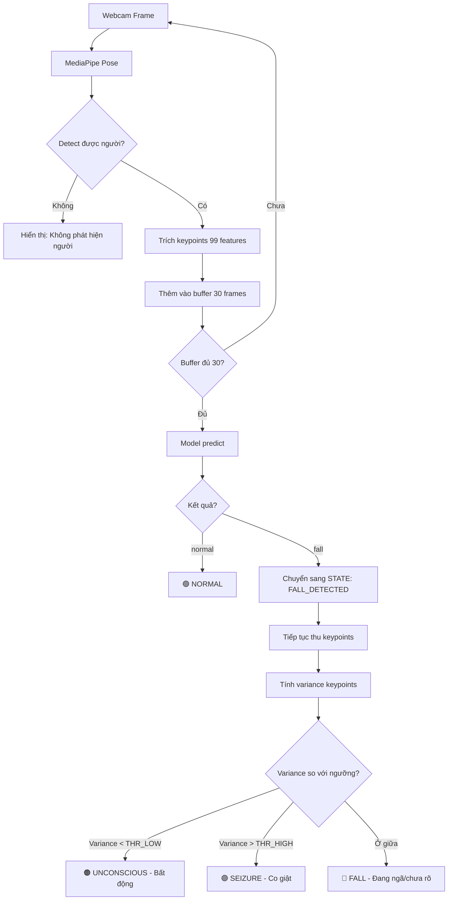

# Kế hoạch triển khai Hướng 3: Hybrid (Model + Rule-based)

## Tổng quan



## Bước 1: Định nghĩa State Machine

Hệ thống có **3 trạng thái**:

| State | Ý nghĩa | Chuyển tiếp |
|-------|---------|-------------|
| `MONITORING` | Đang theo dõi bình thường | → `FALL_DETECTED` khi model predict "fall" |
| `FALL_DETECTED` | Phát hiện ngã, bắt đầu đo variance | → `POST_FALL` sau 1-2 giây (30-60 frames) |
| `POST_FALL` | Đo variance liên tục để phân loại | → `MONITORING` nếu người đứng dậy (model predict "normal") |

```python
class State:
    MONITORING = "monitoring"
    FALL_DETECTED = "fall_detected"
    POST_FALL = "post_fall"
```

## Bước 2: Tính Variance Keypoints

### Công thức

Với buffer 30 frames, mỗi frame có 99 features (33 keypoints × 3 tọa độ):

```python
buffer = np.array(self.buffer)  # shape: (30, 99)

# Tính std theo trục thời gian (axis=0) cho mỗi feature
std_per_feature = np.std(buffer, axis=0)  # shape: (99,)

# Variance tổng = trung bình std của tất cả features
variance = np.mean(std_per_feature)
```

### Nhóm keypoints để tính variance riêng

```python
# Tay (nhạy nhất khi co giật)
ARM_IDX = [13,14,15,16,17,18,19,20,21,22]  # × 3 coords = 30 features
arm_features = [i*3+j for i in ARM_IDX for j in range(3)]
arm_variance = np.mean(std_per_feature[arm_features])

# Chân
LEG_IDX = [25,26,27,28,29,30,31,32]  # × 3 = 24 features
leg_features = [i*3+j for i in LEG_IDX for j in range(3)]
leg_variance = np.mean(std_per_feature[leg_features])

# Thân (ít dao động nhất)
TORSO_IDX = [11,12,23,24]  # × 3 = 12 features
torso_features = [i*3+j for i in TORSO_IDX for j in range(3)]
torso_variance = np.mean(std_per_feature[torso_features])
```

## Bước 3: Xác định ngưỡng (Threshold)

> [!IMPORTANT]
> Ngưỡng cần calibrate dựa trên thực tế webcam. Giá trị dưới đây là ước lượng ban đầu.

| Trạng thái | Variance tổng | Ghi chú |
|------------|--------------|---------|
| **Unconscious** (bất động) | `< 0.015` | Chỉ có noise MediaPipe |
| **Vùng chưa rõ** | `0.015 ~ 0.04` | Có thể do cử động nhẹ |
| **Seizure** (co giật) | `> 0.04` | Dao động rõ ràng, đặc biệt tay chân |

### Cách calibrate ngưỡng

```
Bước 1: Chạy inference, in variance ra console
Bước 2: Nằm yên 10 giây → ghi lại variance (= noise floor)
Bước 3: Giả co giật 10 giây → ghi lại variance
Bước 4: THR_LOW = noise_floor × 2
         THR_HIGH = (noise_floor + seizure_variance) / 2
```

## Bước 4: Logic phân loại trong inference.py

```python
class FallDetector:
    def __init__(self, ...):
        ...
        self.state = State.MONITORING
        self.fall_timer = 0
        self.FALL_CONFIRM_FRAMES = 30  # 1 giây ở 30fps
        self.THR_LOW = 0.015           # Calibrate sau
        self.THR_HIGH = 0.04           # Calibrate sau

    def update(self, frame):
        keypoints, landmarks = self.extract_keypoints(frame)
        self.buffer.append(keypoints)

        if len(self.buffer) < self.n_frames:
            return "waiting", 0.0, landmarks, None

        # --- STATE MACHINE ---

        if self.state == State.MONITORING:
            # Dùng MODEL predict
            label, conf, probs = self._model_predict()

            if label == "fall" and conf > 0.6:
                self.state = State.FALL_DETECTED
                self.fall_timer = 0
                return "fall", conf, landmarks, probs

            return label, conf, landmarks, probs

        elif self.state == State.FALL_DETECTED:
            self.fall_timer += 1

            # Chờ 1 giây để ổn định
            if self.fall_timer < self.FALL_CONFIRM_FRAMES:
                return "fall (đang xác nhận...)", 0.0, landmarks, None

            # Chuyển sang POST_FALL
            self.state = State.POST_FALL
            # fall through to POST_FALL

        if self.state == State.POST_FALL:
            # Dùng VARIANCE thay vì model
            variance = self._compute_variance()

            # Kiểm tra người có đứng dậy không
            label_check, conf_check, _ = self._model_predict()
            if label_check == "normal" and conf_check > 0.7:
                self.state = State.MONITORING
                return "normal", conf_check, landmarks, None

            # Phân loại bằng variance
            if variance < self.THR_LOW:
                return "unconscious", 1.0 - variance/self.THR_LOW, landmarks, {"variance": variance}
            elif variance > self.THR_HIGH:
                return "seizure", min(variance/self.THR_HIGH, 1.0), landmarks, {"variance": variance}
            else:
                return "fall (bất động nhẹ)", 0.5, landmarks, {"variance": variance}

    def _model_predict(self):
        input_tensor = torch.tensor(
            np.array(self.buffer), dtype=torch.float32
        ).unsqueeze(0)
        with torch.no_grad():
            probs = torch.softmax(self.model(input_tensor), dim=1)[0]
        pred_idx = probs.argmax().item()
        return self.label_map[str(pred_idx)], probs[pred_idx].item(), probs

    def _compute_variance(self):
        buffer_np = np.array(self.buffer)  # (30, 99)
        std_per_feature = np.std(buffer_np, axis=0)
        return float(np.mean(std_per_feature))
```

## Bước 5: Hiển thị trên màn hình

```
┌─────────────────────────────────┐
│ FPS: 28.5                       │
│ State: POST_FALL                │
│ Label: UNCONSCIOUS (95%)        │
│ Variance: 0.008                 │
│                                 │
│ ████████░░░░ normal:   12%      │
│ ██░░░░░░░░░░ fall:      3%      │
│ ████████████ unconscious: 95%   │
│ █░░░░░░░░░░░ seizure:    1%     │
│                                 │
│         [skeleton]              │
└─────────────────────────────────┘
```

## Bước 6: Timeline xử lý một ca ngã

```
t=0s     Người đang đứng           → State: MONITORING, Label: normal
t=1.5s   Người ngã xuống           → State: FALL_DETECTED, Label: fall
t=2.5s   Đã nằm 1 giây            → State: POST_FALL, bắt đầu đo variance
t=3s     Nằm yên, variance=0.006  → Label: UNCONSCIOUS
t=5s     Bắt đầu co giật          → variance tăng lên 0.08 → Label: SEIZURE
t=10s    Người đứng dậy           → model detect "normal" → State: MONITORING
```

## Tóm tắt các file cần sửa

| File | Thay đổi |
|------|---------|
| `inference.py` | Thêm State Machine, thêm `_compute_variance()`, sửa logic `update()` và UI hiển thị |

> [!NOTE]
> Chỉ cần sửa **1 file duy nhất** (`inference.py`). Không cần retrain model, không cần thay đổi model_def.py hay các file trong models/.

> [!TIP]
> Sau khi triển khai, chạy lại `py inference.py` và **in variance ra console** trước. Nằm yên + giả co giật để xác định ngưỡng THR_LOW và THR_HIGH chính xác cho webcam của bạn.
