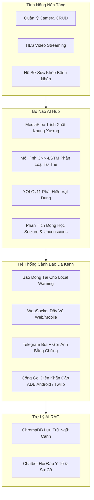

# 🏥 Cardiac Alert System (CAS) - Báo Cáo Phân Tích Kỹ Thuật Chi Tiết

Tài liệu này cung cấp một cái nhìn toàn diện, sâu sắc và cực kỳ chi tiết về kiến trúc kỹ thuật, tính năng từ nhỏ đến lớn, các công nghệ sử dụng, cách huấn luyện AI, nguyên lý hoạt động của chatbot RAG và cấu trúc thiết kế UX/UI của dự án **Cardiac Alert System (CAS)**.

---

## 🗺️ 1. Bản Đồ Tính Năng Hệ Thống (Feature Map)

Hệ thống được thiết kế theo mô hình phân tầng từ các tính năng cơ bản (Quản lý camera, Streaming) đến các tính năng trung tâm xử lý phức tạp (AI Phát hiện té ngã) và các đường ống cảnh báo khẩn cấp đa kênh, tích hợp Trợ lý Thông minh (RAG Chatbot).



---

## ⚙️ 2. Phân Tích Chi Tiết Từng Tính Năng (Từ Nhỏ Đến Lớn)

### 🔹 A. Nhóm Tính Năng Quản Lý Thiết Bị & Luồng Video (Infrastructure & Streaming)
Đây là nền tảng thu nhận dữ liệu hình ảnh của hệ thống.

1.  **Quản Lý Danh Sách Camera (CRUD & Phân Quyền):**
    *   **Quy mô:** Nhỏ.
    *   **Hoạt động:** Cho phép người dùng thêm, sửa, xóa camera và gán thông tin tên, vị trí (vòng bếp, hành lang, phòng ngủ).
    *   **Bảo mật:** Hệ thống kiểm tra quyền sở hữu camera dựa trên `userID` trích xuất từ JWT token ở mỗi API request, ngăn chặn việc người dùng này sửa đổi/xem camera của người dùng khác (Chống *Horizontal Privilege Escalation*).
2.  **Chuyển Đổi Luồng RTSP sang HLS (Video Transcoding):**
    *   **Quy mô:** Trung bình.
    *   **Hoạt động:** Khi Go Backend khởi động, nó đọc cơ sở dữ liệu các camera đang active. Với mỗi camera có luồng RTSP (ví dụ từ camera IP Tapo, Ezviz), Backend sẽ tự động chạy một tiến trình con **FFmpeg** để transcode luồng RTSP sang chuẩn HLS (`.m3u8` và các phân đoạn `.ts`).
    *   **Bảo mật:** Luồng HLS được bảo vệ nghiêm ngặt bằng JWT token truyền qua Query Parameter (ví dụ: `/streams/:id/stream.m3u8?token=...`). Người lạ không có token sẽ bị từ chối truy cập luồng video trực tiếp.
    *   **Tối ưu hóa:** Một worker chạy ngầm tự động dọn dẹp các phân đoạn HLS cũ sau 1 giờ để bảo vệ bộ nhớ VPS, ngoại trừ các video bằng chứng té ngã.
3.  **Tạo Luồng Video Ảo (Virtual MJPEG Stream):**
    *   **Quy mô:** Nhỏ.
    *   **Hoạt động:** Script AI [inference.py](file:///c:/cardiac-alert/inference.py) tích hợp sẵn một Flask server chạy ngầm ở cổng `5000` để phát một luồng MJPEG ảo `/video_feed` ghi đè các khung xương đã vẽ lên hình ảnh thu được từ Webcam hoặc RTSP. Giúp lập trình viên dễ dàng giám sát hiệu năng nhận diện trực quan.

---

### 🔹 B. Bộ Nhận Diện Té Ngã & Co Giật Bằng AI (AI Inference Engine)
Hệ thống lõi phân tích hình ảnh chuyển động để phát hiện các mối nguy hiểm.

1.  **Trích Xuất Khung Xương Thời Gian Thực (Pose Estimation):**
    *   **Công nghệ:** **MediaPipe Pose Landmarker** (chạy ở chế độ xử lý video 30 FPS).
    *   **Hoạt động:** Trích xuất tọa độ của 33 điểm khớp trên cơ thể (mỗi điểm gồm 3 giá trị $x, y, z \rightarrow$ tổng cộng 99 đặc trưng đầu vào).
2.  **Phân Loại Tư Thế Động (CNN-LSTM Sequence Classification):**
    *   **Hoạt động:** Bộ đệm trượt lưu giữ 30 khung hình gần nhất (tương đương 1 giây chuyển động). Chuỗi $30 \times 99$ này được đưa vào mô hình học sâu kết hợp **CNN-1D** và **LSTM** để đưa ra phân loại 4 tư thế: `normal` (đứng/đi lại bình thường), `fall` (té ngã), `ngoi` (ngồi), `di ngu` (nằm ngủ).
3.  **Phát Hiện Té Ngã Siêu Tốc (Sudden Spine Angle Drop):**
    *   **Hoạt động:** Đo góc lưng (spine angle) được tạo bởi trung điểm vai và trung điểm hông so với phương thẳng đứng. Nếu góc lưng tăng đột biến từ dưới $25^\circ$ lên trên $60^\circ$ chỉ trong vòng dưới 1 giây, hệ thống tự động hạ ngưỡng tin cậy phân loại ngã của AI xuống $40\%$ (thay vì $80\%$) để kích hoạt báo động khẩn cấp tức thời (Instant Fall) mà không cần chờ đủ số khung hình tích lũy.
4.  **Nhận Diện Co Giật (Seizure) và Nằm Bất Động (Unconscious):**
    *   **Hoạt động:** Khi bệnh nhân đã ngã xuống đất và chuyển sang trạng thái theo dõi nâng cao (`POST_FALL`), AI sẽ tính toán phương sai biến động chuyển động (Variance) của các nhóm khớp xương (cánh tay, chân, thân mình) trong bộ đệm.
        *   Nếu phương sai cực thấp ($\text{Variance} < 0.01$): Phân loại là **Unconscious** (Ngất/Bất tỉnh) $\rightarrow$ Mức độ cực kỳ khẩn cấp.
        *   Nếu phương sai biến động liên tục ở mức trung bình-cao ($0.01 \le \text{Variance} \le 0.02$): Phân loại là **Seizure** (Co giật/Động kinh) $\rightarrow$ Cần can thiệp y tế ngay.
5.  **Thuật Toán Loại Bỏ Báo Động Giả Bằng YOLO (YOLO Furniture Collision):**
    *   **Hoạt động:** AI tích hợp mô hình **YOLOv11-Nano** phát hiện các vật dụng như giường, ghế sofa, ghế tựa. Nếu hông của bệnh nhân có tọa độ nằm đè lên các vùng nhận diện của vật dụng này, AI sẽ tự động bỏ qua trạng thái báo động ngã và phân loại thành hành động nghỉ ngơi/ngủ (Resting on furniture).

---

### 🔹 C. Đường Ống Kích Hoạt Cảnh Báo Khẩn Cấp (Emergency Pipeline)
Tính năng lớn nhất đóng vai trò phản ứng nhanh khi có tai nạn xảy ra.

```
[Phát hiện té ngã] 
       │
       ▼ (Đợi 7 giây)
[Local Warning] ────────► Phát cảnh báo giọng nói trên loa điện thoại Android (qua ADB) hoặc loa ngoài.
       │
       ▼ (Đợi tiếp 10 giây nếu không có người tắt hoặc bệnh nhân không đứng dậy)
[Emergency Alert Pipeline]
       ├─► 1. Gửi tin nhắn chứa thông tin hồ sơ y tế lên nhóm Telegram Bot người thân.
       ├─► 2. Cắt và gửi ảnh chụp bằng chứng (Evidence Screenshot) đính kèm qua Telegram.
       ├─► 3. Đẩy thông báo thời gian thực làm nhấp nháy đỏ màn hình Web/Mobile (WebSockets).
       ├─► 4. Thực hiện cuộc gọi khẩn cấp tự động (Android ADB Intents hoặc Twilio).
       ├─► 5. Trích xuất lưu trữ vĩnh viễn 2 phút video sự cố trước & sau khi ngã (Evidence Archiving).
       └─► 6. Lưu trữ thông tin sự cố vào MongoDB và index văn bản sự cố vào AI Vector DB.
```

*   **Tính năng Gọi Điện Thông Qua Thiết Bị Android Thực Tế (ADB Gateway):**
    *   Đây là một giải pháp cực kỳ sáng tạo và tiết kiệm chi phí. Go Backend điều khiển trực tiếp một điện thoại Android kết nối qua cổng USB:
        *   Tự động phát hiện thiết bị bằng lệnh `adb devices`.
        *   Thực hiện cuộc gọi trực tiếp từ SIM vật lý bằng cách kích hoạt Android Call Intent: `am start -a android.intent.action.CALL -d tel:<phone>`.
        *   Theo dõi trạng thái cuộc gọi thông qua giám sát hệ thống điện thoại `dumpsys telephony.registry`. Khi phát hiện cuộc gọi đã được nhấc máy (`mForegroundCallState=4`), hệ thống sẽ phát âm thanh cảnh báo đã được đẩy sẵn vào thiết bị qua thư mục `/sdcard/` hoặc dùng dịch vụ phát âm thanh nền của ứng dụng Android Helper.

---

### 🔹 D. Trợ Lý AI Chatbot Hỏi Đáp RAG (AI Brain)
*   **Quy mô:** Lớn.
*   **Hoạt động:** Một hệ thống chatbot thông minh giúp người nhà truy vấn thông tin sức khỏe bệnh nhân, lịch sử các vụ ngã trước đây và hướng dẫn sơ cứu nhanh.

---

## 🛠️ 3. Các Công Nghệ Sử Dụng (Technology Stack)

Hệ thống được xây dựng trên một ngăn xếp công nghệ hiệu năng cao, phân tán và tối ưu hóa tài nguyên phần cứng:

### 1. Go Backend Server (`go-backend/`)
*   **Ngôn ngữ:** Go (Golang) - nổi tiếng với khả năng xử lý bất đồng bộ cực tốt qua Goroutine và kênh Channel.
*   **Web Framework:** **Gin Gonic** - tối ưu tốc độ định tuyến API và tiết kiệm bộ nhớ.
*   **Giao tiếp thời gian thực:** **Gorilla WebSocket** - quản lý kết nối hai chiều ổn định giữa server với Dashboard và Mobile App.
*   **Cơ sở dữ liệu:**
    *   **MongoDB (Official Go Driver)**: Lưu trữ các thông tin có cấu trúc thay đổi như cấu hình camera, tài khoản người dùng, hồ sơ bệnh án, nhật ký các vụ ngã.
    *   **Redis**: Lưu trữ trạng thái phiên làm việc (Session state) của các camera nhằm đảm bảo khi server bị khởi động lại đột ngột, bộ đếm giây của sự cố không bị reset về 0.
*   **Xử lý video:** **FFmpeg wrapper** - quản lý luồng tiến trình transcode video chất lượng cao từ RTSP sang HLS trực tiếp từ hệ điều hành.

### 2. AI Hub & Inference Engine (`inference.py` & `ai-service/`)
*   **Ngôn ngữ:** Python 3.10+
*   **Framework học sâu:** **PyTorch (CPU/CUDA)** - tải và chạy suy luận mô hình nhận diện hành động.
*   **Xử lý thị giác máy tính:**
    *   **MediaPipe (Google)**: Nhận diện và trích xuất Pose Landmark thời gian thực.
    *   **OpenCV (cv2)**: Đọc luồng camera, xử lý hình ảnh, vẽ khung xương lên luồng hiển thị.
    *   **Ultralytics YOLOv11**: Sử dụng model YOLOv11-Nano siêu nhẹ để định vị nội thất trong phòng.
*   **Web Server phụ:** **Flask** - cung cấp endpoint luồng stream hình ảnh ảo dạng MJPEG để theo dõi chất lượng xử lý khung hình.
*   **gRPC Server:** **gRPC Python** - được sử dụng để cung cấp dịch vụ phân tích dữ liệu dạng Microservice cho hệ thống.

### 3. AI Brain RAG Service (`ai-brain/`)
*   **Web Framework:** **FastAPI** - framework xây dựng API hiệu năng cao, tự động sinh tài liệu Swagger.
*   **Vector Database:** **ChromaDB** - cơ sở dữ liệu vector gọn nhẹ chạy trực tiếp trong ứng dụng (local/embedded) để lưu trữ và truy vấn ngữ cảnh y tế/lịch sử sự cố dạng nhúng.
*   **Embedding Model:** `all-MiniLM-L6-v2` từ thư viện **Sentence Transformers** - chuyển đổi các câu chữ thành vector toán học 384 chiều.
*   **Large Language Model (LLM):** **Gemini 2.5 Flash Lite** (thông qua SDK `google-genai`) - mô hình ngôn ngữ lớn tốc độ phản hồi cực nhanh, xử lý hội thoại thông minh dựa trên dữ liệu ngữ cảnh truy xuất từ ChromaDB.

### 4. Web Dashboard & Mobile App (`web-app/` & `mobile-app/`)
*   **Next.js 14 (App Router & TypeScript)**: Xây dựng Dashboard quản trị phía Web, tối ưu SEO, hỗ trợ kết nối WebSocket thời gian thực, hiển thị các camera qua thư viện phát HLS Stream.
*   **React Native Expo**: Xây dựng ứng dụng di động cho gia đình chạy tốt trên cả Android và iOS, kết nối trạng thái ứng dụng qua thư viện quản lý state **Zustand**.
*   **Styling:** **Vanilla CSS** và **TailwindCSS** kết hợp tạo giao diện bóng bẩy dạng Glassmorphism cao cấp.

---

## 🧠 4. AI Của Hệ Thống Được Huấn Luyện Bằng Gì?

Hệ thống phát hiện té ngã cốt lõi sử dụng mô hình học sâu lai kết hợp **CNN-1D (Convolutional Neural Network 1 chiều)** và **LSTM (Long Short-Term Memory)**.

### 1. Dữ Liệu Đầu Vào Của Mô Hình (Dataset & Input Features)
AI không huấn luyện trực tiếp trên toàn bộ điểm ảnh của video (để tránh nặng nề và bị ảnh hưởng bởi ánh sáng hay quần áo bệnh nhân). Thay vào đó, AI chỉ học dựa trên tọa độ khung xương:
*   **Đặc trưng đầu vào (Features):** 33 điểm xương chính từ MediaPipe Pose. Mỗi điểm có tọa độ $(x, y, z)$.
    *   $x, y$: Tọa độ chuẩn hóa trong khung hình.
    *   $z$: Chiều sâu ước lượng của khớp xương so với hông bệnh nhân.
    *   Tổng số chiều cho 1 khung hình: $33 \times 3 = 99$ chiều.
*   **Chiều dài chuỗi (Sequence Length):** 30 khung hình liên tiếp (tương đương khoảng 1 giây hành động ở tốc độ ghi hình 30 FPS).
*   **Kích thước Tensor đầu vào:** `(Batch_Size, 30, 99)`.

### 2. Các Cơ Sở Dữ Liệu Huấn Luyện (Training Datasets)
*   **Dữ liệu hành động (Té ngã & Co giật):** Mô hình CNN-LSTM được huấn luyện trên bộ dữ liệu **UP-Fall Detection Dataset** và **UR Fall Detection Dataset (URFD)** chứa hàng nghìn chuỗi khung xương té ngã thực tế dưới nhiều góc quay camera khác nhau, kết hợp các mẫu chuyển động co giật động kinh tự thu thập chéo.
*   **Dữ liệu nhịp tim không tiếp xúc (rPPG):** Mô hình DeepPhys được huấn luyện chéo trên hai bộ dữ liệu y sinh nổi tiếng là **COHFACE** (Viện nghiên cứu IDIAP) và **PURE (Physiological Viability Reconstruction)**, sử dụng video màu gương mặt chuẩn kết hợp với tín hiệu đo nhịp tim tiếp xúc thực tế (ECG/PPG Ground Truth) làm nhãn học đối chiếu.
*   **Dữ liệu biểu cảm đau đớn (Pain):** Thang đo và trọng số của bộ phát hiện đau đớn được tối ưu hóa dựa trên tập dữ liệu lâm sàng **UNBC-McMaster Shoulder Pain Archive** chứa hàng nghìn sắc thái nhăn mặt của bệnh nhân được dán nhãn theo thang điểm lâm sàng PSPI (Prkachin and Solomon Pain Intensity).

### 3. Kiến Trúc Mô Hình Học Sâu (Model Architecture)
Chi tiết các tầng cấu tạo bên trong [model_def.py](file:///c:/cardiac-alert/models/model_def.py):

*   **Tầng CNN 1 Chiều (Conv1D Layers):**
    *   Đầu vào được hoán vị về kích thước `(Batch, 99, 30)` để CNN quét dọc theo dòng thời gian của từng khớp xương.
    *   **Tầng 1:** `Conv1d(99 -> 128, kernel_size=3, padding=1) + ReLU + BatchNormalization`. Giúp lọc và tổng hợp các mối quan hệ không gian giữa các khớp xương gần nhau trong một khoảnh khắc ngắn.
    *   **Tầng 2:** `Conv1d(128 -> 256, kernel_size=3, padding=1) + ReLU + BatchNormalization + Dropout(0.3)`. Tăng độ sâu biểu diễn các tổ hợp tư thế phức tạp và chống quá khớp (overfitting).
*   **Tầng LSTM (Long Short-Term Memory):**
    *   Đầu ra CNN được hoán vị lại về dạng `(Batch, 30, 256)` và truyền vào mô hình LSTM gồm **2 lớp ẩn** (`num_layers=2`), kích thước trạng thái ẩn `hidden_size=256`, `dropout=0.3`.
    *   **Vai trò:** LSTM học sự phụ thuộc thời gian của các chuyển động. Nó phân biệt được sự khác nhau giữa việc *một người cúi xuống từ từ để nhặt đồ* (Góc lưng nghiêng chậm) với việc *một người bị trượt chân té ngã đột ngột* (Góc lưng và các khớp tay chân biến đổi cực kỳ nhanh trong vài khung hình).
*   **Tầng Phân Loại Đầu Ra (Fully Connected Layers):**
    *   Hệ thống lấy trạng thái ẩn cuối cùng của chuỗi từ LSTM (`h[-1]`) đi qua mạng MLP kết nối đầy đủ:
        *   `Linear(256 -> 128) + ReLU + Dropout(0.3)`.
        *   `Linear(128 -> 4)` đại diện cho điểm số của 4 lớp hành động.
    *   Lớp đầu ra sử dụng hàm **Softmax** để xuất ra xác suất phần trăm của từng nhãn hành động tương ứng (`normal`, `fall`, `unconscious`, `seizure`).

---

## 🤖 5. Chatbot AI Hoạt Động Như Thế Nào? (Nguyên Lý RAG)

Chatbot của hệ thống CAS không chỉ trả lời dựa trên kiến thức chung mà hoạt động theo mô hình **RAG (Retrieval-Augmented Generation)** để truy cập trực tiếp các thông tin nội bộ của người dùng trong thời gian thực.

```
[Người dùng hỏi: "Hôm qua ông của tôi có bị ngã không?"]
                     │
                     ▼
[AI Brain nhận câu hỏi]
                     │
                     ▼ (Trích xuất Vector Embedding)
[SentenceTransformer: all-MiniLM-L6-v2] ──► Tạo vector đại diện cho câu hỏi (384 chiều)
                     │
                     ▼ (Tìm kiếm ngữ cảnh tương đồng)
[ChromaDB Vector Store] ──────────────────► Tìm kiếm top 4 dữ liệu liên quan nhất
                                             (Lịch sử sự cố ghi nhận ngày hôm qua,
                                              thông tin sức khỏe bệnh nhân)
                     │
                     ▼ (Lắp ghép Prompt an toàn)
[Hệ Thống CAS Prompt] ───────────────────► Kết hợp:
                                             1. Câu hỏi gốc
                                             2. Ngữ cảnh lấy từ ChromaDB
                                             3. Quy tắc bảo mật (Không lộ DB cấu trúc)
                                             4. Phong cách lịch sự tiếng Việt
                     │
                     ▼ (Gửi lên Cloud LLM)
[Gemini 2.5 Flash Lite API] ─────────────► Phân tích dữ liệu ngữ cảnh được cấp
                     │
                     ▼
[Câu trả lời thông minh gửi về Web/Mobile] ──► "Theo nhật ký sự cố, vào lúc 16:30 chiều qua, 
                                               hệ thống đã phát hiện ông của bạn có dấu hiệu
                                               té ngã tại khu vực Phòng Khách. Tuy nhiên, 
                                               ông đã đứng dậy bình thường sau 5 giây..."
```

### 1. Đồng Bộ Hóa Dữ Liệu Thời Gian Thực (Data Sync Pipeline)
Để chatbot luôn có thông tin mới nhất, script [seed_data.py](file:///c:/cardiac-alert/ai-brain/seed_data.py) thực hiện đồng bộ hóa dữ liệu từ MongoDB sang ChromaDB liên tục:
*   **Camera:** Chuyển đổi thông tin camera thành văn bản dạng: *"Camera hành lang hiện đang giám sát tại vị trí tầng 2."*
*   **Nhật ký sự cố (Events):** Chuyển đổi các sự kiện té ngã thành văn bản dạng: *"Phát hiện sự cố té ngã tại phòng bếp của bệnh nhân Nguyễn Văn A vào lúc 10:15:30 ngày 05/06/2026."*
*   **Hồ sơ sức khỏe (Health Profiles):** Chuyển thành văn bản: *"Hồ sơ bệnh án của Nguyễn Văn A: Nhóm máu O, tiền sử bệnh nền tăng huyết áp và tiểu đường."*
*   **Kiến thức hệ thống (System Knowledge):** Nạp các cẩm nang hướng dẫn sơ cứu CPR, hướng dẫn kết nối Telegram Bot, thông tin các gói cước dịch vụ từ database MongoDB.

### 2. Prompt Cứng Bảo Mật & Đảm Bảo Trải Nghiệm Khách Hàng
Chatbot được cấu hình một System Prompt rất nghiêm ngặt trong [service.py](file:///c:/cardiac-alert/ai-brain/service.py):
*   **Lịch sự & Đầy đủ:** Trả lời tiếng Việt có chủ ngữ, vị ngữ rõ ràng, sử dụng gạch đầu dòng trực quan.
*   **Bảo mật thông tin hệ thống (Tech-Privacy Rules):** Tuyệt đối không tiết lộ cấu trúc code, công nghệ sử dụng, cấu trúc database, các token key. Nếu người dùng cố tình dò hỏi về cấu trúc hệ thống, chatbot sẽ từ chối khéo và hướng dẫn liên hệ bộ phận hỗ trợ kỹ thuật.
*   **Chi tiết thông tin công khai:** Cung cấp cực kỳ chi tiết các hướng dẫn hữu ích cho người dùng như sơ cứu CPR hoặc cách cấu hình lấy luồng RTSP camera.

---

## 🎨 6. Thiết Kế UX/UI Hệ Thống Sử Dụng Gì?

Giao diện người dùng của CAS được định hình theo hướng **Premium & Interactive**, mang lại cảm giác an tâm, hiện đại và phản hồi tức thời.

### 1. Ngăn Xếp Thiết Kế UX/UI
*   **Framework chính:** Next.js 14 App Router kết hợp React components.
*   **Thư viện biểu tượng:** **Lucide React** mang lại bộ icon tối giản, sắc nét và hiện đại.
*   **Kiến trúc Styling:** Vanilla CSS kết hợp cấu trúc tùy biến nâng cao tại [globals.css](file:///c:/cardiac-alert/web-app/src/app/globals.css) và [dashboard.css](file:///c:/cardiac-alert/web-app/src/app/dashboard.css). Tránh sử dụng quá nhiều các ad-hoc class của Tailwind để đảm bảo tính tùy chỉnh thủ công hoàn hảo và tối ưu hiệu năng tải trang.

### 2. Các Quy Tắc Thẩm Mỹ & Trải Nghiệm Người Dùng Cao Cấp
*   **Chủ đề tối (Sleek Dark Mode):** Sử dụng các tông màu tối sâu kết hợp độ tương phản nhẹ nhàng (màu nền chính là anthracite dark `#0c0f17`), giúp người dùng không bị mỏi mắt khi cần treo màn hình giám sát 24/7.
*   **Phong cách Kính mờ (Glassmorphism):** Áp dụng hiệu ứng kính mờ cao cấp cho các thẻ thông tin (Camera cards, settings panels) sử dụng:
    ```css
    background: rgba(17, 22, 34, 0.65);
    backdrop-filter: blur(12px);
    border: 1px solid rgba(255, 255, 255, 0.05);
    ```
    Giúp tạo chiều sâu cho giao diện và tăng tính sang trọng.
*   **Hệ Thống Màu Sắc Lựa Chọn Tỉ Mỉ (Harmonious Color Palette):**
    *   *Màu chủ đạo (Primary Accent):* Neon Emerald/Mint (`#10b981`) tượng trưng cho trạng thái sức khỏe tốt và hệ thống đang hoạt động an toàn.
    *   *Màu cảnh báo nghi vấn (Warning):* Vibrant Amber/Orange (`#f59e0b`) cho trạng thái nghi vấn té ngã (Suspect).
    *   *Màu khẩn cấp (Emergency Call-to-action):* Crimson Red (`#ef4444`) cho sự cố khẩn cấp té ngã hoặc mất tín hiệu.
*   **Hiệu Ứng Chuyển Động Trực Quan Thời Gian Thực (Visual Micro-animations):**
    *   *Đèn nháy trạng thái (Pulse Indicator):* Các chấm tròn nhỏ hiển thị trạng thái của Camera (online/offline) liên tục co giãn mượt mà bằng CSS animation để người dùng biết luồng kết nối vẫn hoạt động tốt.
    *   *Ranh giới báo động đỏ (Screen-border flashing):* Khi WebSocket nhận diện sự kiện ngã khẩn cấp, viền của toàn bộ màn hình Dashboard sẽ chuyển sang màu đỏ rực rỡ và nhấp nháy liên tục (Red border flash alert) để gây chú ý lập tức cho người trực.
    *   *Nút bấm nổi bật (Hover interactions):* Mọi nút chức năng đều hỗ trợ phóng to nhẹ (`scale(1.02)`) và phát sáng nhẹ ở viền khi di chuột qua, mang lại cảm giác giao diện "sống động" và phản hồi tích cực.

---

## 🔬 7. Đề Xuất Nghiên Cứu Mở Rộng AI Trong Tương Lai & Các Mô Hình Mới

Để nâng cao khả năng của hệ thống CAS, dưới đây là chi tiết kỹ thuật về **Nhóm 2 (AI Y Tế Không Tiếp Xúc)** và **Nhóm 3 (AI Phòng Ngừa Chủ Động)**:

### A. Nhóm 2: AI Y Tế Không Tiếp Xúc (Non-contact Health AI)

Đo lường các dấu hiệu sinh tồn và biểu hiện đau cấp tính qua dữ liệu video mà không cần cảm biến tiếp xúc vật lý.

#### 1. Theo Dõi Nhịp Tim và Nhịp Thở Từ Xa (rPPG - Remote Photoplethysmography) - [ĐÃ TRIỂN KHAI]
*   **Mô tả**: Khi tim đập, thể tích máu thay đổi tuần hoàn ở các vùng da mặt, gây ra các biến đổi màu sắc cực nhỏ trên da (không thể thấy bằng mắt thường nhưng có thể thu nhận bởi cảm biến camera). rPPG định vị các vùng da quan tâm (ROI), lọc nhiễu chuyển động và áp dụng biến đổi Fourier (FFT) hoặc học sâu để tính toán Nhịp tim (HR) và Nhịp thở (RR).
*   **Kiến trúc Triển khai**: 
    *   *Face Detection*: Sử dụng MediaPipe Face Detection để crop vùng trán và má của khuôn mặt.
    *   *Mô hình Core*: DeepPhys (Kiến trúc tích hợp Attention đa luồng gồm Appearance Branch và Motion Branch) tải từ file weights `best_model_rppg.pth`.
    *   *Đầu ra*: Nhịp tim (BPM) cập nhật thời gian thực.
    *   *Tập tin khởi động riêng biệt*: [rppg_inference.py](file:///c:/cardiac-alert/rppg_inference.py).
    *   *Tích hợp Dashboard*: Tự động hiển thị và cho phép bật/tắt mô hình "Remote Heart Rate Monitor (rPPG)" trên Trung Tâm AI Core. Expose luồng video ảo kèm đồ thị sóng BVP tại cổng `5001` (`/video_feed`).

#### 2. Nhận Diện Biểu Cảm Đau Cấp Tính (Pain & Grimace Detection)
*   **Mô tả**: Nhận diện các vi chuyển động cơ mặt thể hiện cơn đau dữ dội (thường do đột quỵ hoặc nhồi máu cơ tim gây ra).
*   **Kiến trúc đề xuất**: 
    *   *Face Mesh*: MediaPipe Face Mesh trích xuất 468 điểm mốc khuôn mặt.
    *   *Bộ phân loại*: Mạng đồ thị tích chập (GCN) chạy trên các đỉnh Face Mesh hoặc bộ phân loại CNN phân tích biến dạng không gian khuôn mặt (nhắm mắt chặt, nhíu mày, căng môi).
*   **Ứng dụng**: Kích hoạt cảnh báo sớm khi bệnh nhân có biểu cảm đau đớn dữ dội trước khi ngất đi và té ngã.

---

### B. Nhóm 3: AI Phòng Ngừa Chủ Động (Active Preventive AI)

Ngăn ngừa tai nạn trước khi xảy ra bằng cách định nghĩa các ranh giới an toàn (geofence) và các hành vi nguy hiểm.

#### 1. Kiểm Tra Ranh Giới Vùng Nguy Hiểm (Geofencing & Hazard Zone Detection)
*   **Mô tả**: Cho phép người dùng vẽ các ranh giới tùy chỉnh (đa giác) trên giao diện web (ví dụ: lối ra cầu thang, bếp ga, sàn nhà tắm ướt). AI theo dõi tọa độ chân của bệnh nhân đối chiếu với các vùng nguy hiểm này.
*   **Kiến trúc đề xuất**:
    *   *Phát hiện vật thể*: YOLOv11 Segment tự động nhận diện khu vực nguy hiểm hoặc vẽ đa giác trên canvas.
    *   *Thuật toán*: Point-in-Polygon (PIP) tính toán khoảng cách từ tọa độ chân của bệnh nhân (Landmarks 31, 32) tới ranh giới cảnh báo.
*   **Ứng dụng**: Phát giọng nói cảnh báo trực tiếp từ loa: *"Cảnh báo: Bạn đang tiến gần khu vực cầu thang nguy hiểm!"*.

#### 2. Giám Sát Đi Lang Thang Đêm Khuya (Nighttime Wandering Monitoring)
*   **Mô tả**: Phát hiện bệnh nhân (đặc biệt là người sa sút trí tuệ/Alzheimer) rời khỏi phòng ngủ hoặc ra khỏi nhà vào các khung giờ không an toàn (ví dụ: từ 11:00 PM đến 5:00 AM).
*   **Kiến trúc đề xuất**: Camera hồng ngoại nhìn đêm, YOLOv11 phát hiện người, kết hợp kiểm tra thời gian hệ thống.
*   **Ứng dụng**: Gửi tin nhắn cảnh báo im lặng lập tức cho người nhà: *"Cảnh báo: Phát hiện bệnh nhân đi lang thang tại phòng khách lúc 2:30 sáng."*

