# 🏥 Cardiac Alert System (CAS) - Complete Use Case Specifications

This document provides the formal **Use-case Specifications** for all **27 Use Cases** of the **Cardiac Alert System (CAS)**. The specifications are structured in academic table formats, detailing actors, preconditions, postconditions, main flows, alternative flows, and exception flows.

---

## 3.6.2 Use-case Specifications

### 🔹 Nhóm 1: Quản Lý Tài Khoản & Cấu Hình (Account & Configuration)

#### 3.6.2.1 UC01 - Login
*Table 3.1 Specification UC Login*

| Field | Description |
| :--- | :--- |
| **Use Case Name** | Login |
| **Primary Actor** | Caregiver |
| **Description** | The caregiver signs in to the Web Dashboard using an existing account. |
| **Preconditions** | The caregiver has already registered an account. |
| **Postconditions** | The caregiver is authenticated and redirected to the Dashboard Home screen. |
| **Main Flow** | <ul><li>The caregiver opens the Web Dashboard.</li><li>The caregiver enters valid login credentials (username and password).</li><li>The system verifies the credentials against MongoDB.</li><li>The system generates a secure JWT token for the session.</li><li>The system redirects the caregiver to the Dashboard Home screen.</li></ul> |
| **Alternative Flow** | None. |
| **Exception Flow** | Invalid credentials, expired session, or backend database connection error. |

---

#### 3.6.2.2 UC02 - Register Account
*Table 3.2 Specification UC Register Account*

| Field | Description |
| :--- | :--- |
| **Use Case Name** | Register Account |
| **Primary Actor** | Caregiver |
| **Description** | The caregiver creates a new account to access the system. |
| **Preconditions** | None. |
| **Postconditions** | A new caregiver account is saved in MongoDB, and the caregiver is prompted to log in. |
| **Main Flow** | <ul><li>The caregiver opens the registration page on the Web Dashboard.</li><li>The caregiver enters details: Username, Email, Password, and Password Confirmation.</li><li>The caregiver clicks the "Register" button.</li><li>The system validates email format, password strength, and password match.</li><li>The system hashes the password and creates a new user document in MongoDB.</li><li>The system displays a registration success message and redirects to the login screen.</li></ul> |
| **Alternative Flow** | None. |
| **Exception Flow** | Username or Email already exists, password validation failure, or database write timeout. |

---

#### 3.6.2.3 UC03 - Configure Patient Health Profile
*Table 3.3 Specification UC Configure Patient Health Profile*

| Field | Description |
| :--- | :--- |
| **Use Case Name** | Configure Patient Health Profile |
| **Primary Actor** | Caregiver |
| **Description** | The caregiver sets up or updates the medical history, blood type, and emergency contacts of the patient. |
| **Preconditions** | The caregiver is logged into the Web Dashboard. |
| **Postconditions** | The patient's health profile is saved to MongoDB and synchronized to the ChromaDB vector store. |
| **Main Flow** | <ul><li>The caregiver navigates to the Settings page on the Web Dashboard.</li><li>The caregiver inputs the patient's information (Name, Age, Blood Type, medical history, emergency phone numbers, and Telegram Chat ID).</li><li>The caregiver clicks the "Save Profile" button.</li><li>The system validates the input fields.</li><li>The system updates the profile records in MongoDB.</li><li>The system synchronizes the profile context to the local ChromaDB vector store for AI chatbot lookup.</li><li>The system displays a success confirmation message.</li></ul> |
| **Alternative Flow** | None. |
| **Exception Flow** | Empty required fields, invalid database connection, or failure to synchronize context to ChromaDB. |

---

### 🔹 Nhóm 2: Quản Lý Thiết Bị & Video (Device & Video Stream Management)

#### 3.6.2.4 UC04 - Add Camera
*Table 3.4 Specification UC Add Camera*

| Field | Description |
| :--- | :--- |
| **Use Case Name** | Add Camera |
| **Primary Actor** | Caregiver |
| **Description** | The caregiver adds a new monitoring camera with an RTSP stream URL to initiate live video transcoding. |
| **Preconditions** | The caregiver is logged into the Web Dashboard. |
| **Postconditions** | The camera metadata is saved, and a background FFmpeg process is spawned to transcode the RTSP stream. |
| **Main Flow** | <ul><li>The caregiver navigates to the Camera Management panel.</li><li>The caregiver inputs the camera name, physical location, and RTSP stream URL.</li><li>The caregiver clicks the "Add Camera" button.</li><li>The system saves the camera configurations to MongoDB.</li><li>The Go Backend spawns an FFmpeg subprocess to transcode the RTSP feed into secure HLS segments.</li><li>The system displays the newly added live camera feed on the dashboard grid.</li></ul> |
| **Alternative Flow** | None. |
| **Exception Flow** | Invalid RTSP URL format, RTSP stream source unreachable, or FFmpeg transcoding failure. |

---

#### 3.6.2.5 UC05 - View Camera List
*Table 3.5 Specification UC View Camera List*

| Field | Description |
| :--- | :--- |
| **Use Case Name** | View Camera List |
| **Primary Actor** | Caregiver |
| **Description** | The caregiver views a list of all configured cameras, checking their real-time online/offline statuses. |
| **Preconditions** | The caregiver is logged into the Web Dashboard. |
| **Postconditions** | The system renders a grid display showing all active and inactive cameras belonging to the caregiver. |
| **Main Flow** | <ul><li>The caregiver accesses the Dashboard Home screen.</li><li>The Web Dashboard requests the camera list from the Go Backend.</li><li>The backend queries MongoDB for cameras matching the caregiver's `userID`.</li><li>The backend queries Redis to verify active stream session states (online/offline).</li><li>The system returns the metadata list, rendering interactive camera cards.</li></ul> |
| **Alternative Flow** | None. |
| **Exception Flow** | Session expired, or MongoDB query timeout. |

---

#### 3.6.2.6 UC06 - Edit Camera Details
*Table 3.6 Specification UC Edit Camera Details*

| Field | Description |
| :--- | :--- |
| **Use Case Name** | Edit Camera Details |
| **Primary Actor** | Caregiver |
| **Description** | The caregiver updates a camera's descriptive name, location, or RTSP URL. |
| **Preconditions** | The caregiver is logged in and owns the camera. |
| **Postconditions** | The camera details are updated in MongoDB, and the transcoding process is updated. |
| **Main Flow** | <ul><li>The caregiver clicks the "Edit" button on a camera card.</li><li>The caregiver modifies the camera's location, name, or RTSP stream URL.</li><li>The caregiver clicks the "Update" button.</li><li>The Go Backend checks the caregiver's ownership validation.</li><li>The backend updates MongoDB with the modified fields.</li><li>If the RTSP URL changed, the backend terminates the active FFmpeg process and spawns a new one with the new URL.</li></ul> |
| **Alternative Flow** | None. |
| **Exception Flow** | Unauthorized edit attempt (Horizontal Privilege Escalation), invalid URL, or database save failure. |

---

#### 3.6.2.7 UC07 - Delete Camera
*Table 3.7 Specification UC Delete Camera*

| Field | Description |
| :--- | :--- |
| **Use Case Name** | Delete Camera |
| **Primary Actor** | Caregiver |
| **Description** | The caregiver permanently removes a camera from the system. |
| **Preconditions** | The caregiver is logged in and owns the camera. |
| **Postconditions** | The camera document is deleted from MongoDB, and the active FFmpeg process is killed. |
| **Main Flow** | <ul><li>The caregiver clicks the "Delete" button on a camera card.</li><li>The system prompts for confirmation.</li><li>The caregiver confirms the deletion.</li><li>The Go Backend verifies ownership.</li><li>The backend removes the camera document from MongoDB.</li><li>The backend kills the active FFmpeg transcoding process and deletes temporary stream directories.</li></ul> |
| **Alternative Flow** | None. |
| **Exception Flow** | Unauthorized delete attempt, or database write timeout. |

---

#### 3.6.2.8 UC08 - View Live HLS Stream
*Table 3.8 Specification UC View Live HLS Stream*

| Field | Description |
| :--- | :--- |
| **Use Case Name** | View Live HLS Stream |
| **Primary Actor** | Caregiver |
| **Description** | The caregiver plays the live HLS video feed on the Web Dashboard. |
| **Preconditions** | The caregiver is logged in, and the camera is actively transcoding. |
| **Postconditions** | The video player renders the live stream securely using a verified HLS query token. |
| **Main Flow** | <ul><li>The caregiver opens the video monitoring section of the Web Dashboard.</li><li>The video player requests the stream manifest (`stream.m3u8`), appending the JWT token to the URL query parameters.</li><li>The Go Backend checks JWT signature validation and camera resource ownership.</li><li>The backend serves the requested stream files to the client.</li><li>The player compiles HLS segments and renders the video stream.</li></ul> |
| **Alternative Flow** | None. |
| **Exception Flow** | Missing or expired token query parameter, or stream process crashed. |

---

### 🔹 Nhóm 3: Nhận Diện & Xác Thực Sự Cố AI (AI Inference Engine)

#### 3.6.2.9 UC09 - Real-time Posture Analysis
*Table 3.9 Specification UC Real-time Posture Analysis*

| Field | Description |
| :--- | :--- |
| **Use Case Name** | Real-time Posture Analysis |
| **Primary Actor** | AI Inference Engine |
| **Description** | The AI engine processes the camera feed frames to classify user posture at 30 FPS. |
| **Preconditions** | The camera feed is active and the AI Inference script is running. |
| **Postconditions** | The current posture label is classified continuously. |
| **Main Flow** | <ul><li>The AI engine captures video frames from the stream at 30 FPS.</li><li>The system extracts 33 skeletal body landmarks using MediaPipe.</li><li>The system maintains the last 30 frames of coordinates in a sliding buffer.</li><li>The CNN-LSTM model processes the buffer to classify the posture (`normal`, `fall`, `ngoi`, or `di ngu`).</li><li>The system renders the skeleton overlay onto the video stream for MJPEG debug feeds.</li></ul> |
| **Alternative Flow** | None. |
| **Exception Flow** | Frame grab failure, or skeletal tracking points lost. |

---

#### 3.6.2.10 UC10 - Instant Fall Detection
*Table 3.10 Specification UC Instant Fall Detection*

| Field | Description |
| :--- | :--- |
| **Use Case Name** | Instant Fall Detection |
| **Primary Actor** | AI Inference Engine |
| **Description** | The system bypasses the frame classification buffer if a rapid spinal angle drop is detected. |
| **Preconditions** | MediaPipe skeletal landmarks are actively tracked. |
| **Postconditions** | The fall confidence threshold is instantly lowered to trigger the alert sequence immediately. |
| **Main Flow** | <ul><li>The system monitors the angle between the patient's spine (midpoint shoulders to midpoint hips) and the vertical axis.</li><li>The system calculates the speed of the angle changes.</li><li>If the spine angle drops from <25° to >60° in less than 1 second, the system detects a sudden fall.</li><li>The system drops the classification threshold to 40% confidence.</li><li>The system triggers the fall warning sequence immediately.</li></ul> |
| **Alternative Flow** | None. |
| **Exception Flow** | Landmark tracking lost due to occlusion. |

---

#### 3.6.2.11 UC11 - Suppress False Alarms
*Table 3.11 Specification UC Suppress False Alarms*

| Field | Description |
| :--- | :--- |
| **Use Case Name** | Suppress False Alarms |
| **Primary Actor** | AI Inference Engine |
| **Description** | The AI engine uses YOLOv11 furniture detection to prevent alarms if a user falls/lies on a bed or sofa. |
| **Preconditions** | YOLOv11 object detector is loaded. |
| **Postconditions** | The fall event is suppressed if an overlap with furniture is verified. |
| **Main Flow** | <ul><li>YOLOv11 scans the video feed to detect furniture (bed, couch, chair).</li><li>The system records the bounding box coordinates for each detected object.</li><li>The system checks the patient's hip and torso coordinate coordinates.</li><li>If the patient's coordinates overlap with a furniture bounding box, the system overrides a classified `fall` to `resting` (sleeping/resting).</li><li>The system suppresses the fall alarm trigger.</li></ul> |
| **Alternative Flow** | None. |
| **Exception Flow** | YOLOv11 model file missing or object detection pipeline failure. |

---

### 🔹 Nhóm 4: Xử Lý & Phản Ứng Cảnh Báo Phân Tầng (Tiered Incident Alert Pipeline)

#### 3.6.2.12 UC12 - Trigger Local Audio Warning
*Table 3.12 Specification UC Trigger Local Audio Warning*

| Field | Description |
| :--- | :--- |
| **Use Case Name** | Trigger Local Audio Warning |
| **Primary Actor** | Go Backend Server |
| **Description** | The system plays a voice announcement near the patient when a suspect fall is detected. |
| **Preconditions** | The AI Inference Engine detects a suspect fall and posts it to the backend. |
| **Postconditions** | A local warning audio announcement is played, and a 7-second countdown begins. |
| **Main Flow** | <ul><li>The Go Backend receives a suspect fall event.</li><li>The system updates the camera status to `suspect` in Redis.</li><li>The system triggers a local audio warning to play near the patient.</li><li>The system launches a 7-second countdown.</li></ul> |
| **Alternative Flow** | None. |
| **Exception Flow** | Local audio speaker connection failure. |

---

#### 3.6.2.13 UC13 - Trigger Web Flashing Alert
*Table 3.13 Specification UC Trigger Web Flashing Alert*

| Field | Description |
| :--- | :--- |
| **Use Case Name** | Trigger Web Flashing Alert |
| **Primary Actor** | Go Backend Server |
| **Description** | The backend sends a real-time WebSocket alert payload to flash the Web Dashboard. |
| **Preconditions** | The fall countdown transitions to an active alert state. |
| **Postconditions** | The Web Dashboard screen borders flash red to capture the caregiver's attention. |
| **Main Flow** | <ul><li>The Go Backend verifies that the alert countdown has elapsed.</li><li>The WebSocket hub retrieves all active dashboard connection sessions matching the caregiver's `userID`.</li><li>The backend broadcasts a JSON warning payload.</li><li>The Web Dashboard receives the payload and adds a CSS flashing animation class to the screen container.</li></ul> |
| **Alternative Flow** | None. |
| **Exception Flow** | WebSocket connection dropped, or client offline. |

---

#### 3.6.2.14 UC14 - Send Telegram Alert with Evidence
*Table 3.14 Specification UC Send Telegram Alert with Evidence*

| Field | Description |
| :--- | :--- |
| **Use Case Name** | Send Telegram Alert with Evidence |
| **Primary Actor** | Go Backend Server |
| **Description** | The backend sends a detailed text notification and screenshot evidence of the fall to the Telegram group. |
| **Preconditions** | The emergency alert pipeline is triggered. |
| **Postconditions** | A message containing patient medical files and screenshot evidence is posted to Telegram. |
| **Main Flow** | <ul><li>The backend captures the exact video frame matching the fall timestamp.</li><li>The system queries MongoDB for the patient's medical history and emergency contacts.</li><li>The system compiles a descriptive warning message.</li><li>The system invokes the Telegram Bot API to send the message and screenshot to the caregiver's chat group.</li></ul> |
| **Alternative Flow** | None. |
| **Exception Flow** | Telegram API timeout, invalid bot token, or group Chat ID configuration error. |

---

#### 3.6.2.15 UC15 - Place Emergency Phone Call
*Table 3.15 Specification UC Place Emergency Phone Call*

| Field | Description |
| :--- | :--- |
| **Use Case Name** | Place Emergency Phone Call |
| **Primary Actor** | Go Backend Server |
| **Description** | The backend dials the caregiver's number via Twilio, playing synthesized Voice alerts once answered. |
| **Preconditions** | The fall immobility countdown reaches 10 seconds. |
| **Postconditions** | A voice call is placed to the caregiver, delivering a TTS incident report. |
| **Main Flow** | <ul><li>The Go Backend initiates the telephony call pipeline.</li><li>The backend calls the Twilio API, providing the target caregiver's phone number.</li><li>Twilio dials the caregiver.</li><li>When the caregiver answers, Twilio requests synthesized TTS voice alerts from the Go backend.</li><li>The system plays voice alerts stating the patient's name and critical fall status.</li></ul> |
| **Alternative Flow** | None. |
| **Exception Flow** | Twilio credentials invalid, target number busy/unreachable, or TTS synthesis error. |

---

#### 3.6.2.16 UC16 - Archive Incident Video
*Table 3.16 Specification UC Archive Incident Video*

| Field | Description |
| :--- | :--- |
| **Use Case Name** | Archive Incident Video |
| **Primary Actor** | Go Backend Server |
| **Description** | The backend copies HLS segments surrounding the fall incident to permanent storage. |
| **Preconditions** | The emergency alert pipeline is triggered. |
| **Postconditions** | A 2-minute video file containing 1 minute before and 1 minute after the fall is saved. |
| **Main Flow** | <ul><li>The backend calculates the start and end timestamps surrounding the fall event.</li><li>The system copies the matching temporary `.ts` video segments to `/storage/archives/`.</li><li>The system compiles the segments into a named archive folder.</li><li>The system records the file path into the incident document in MongoDB.</li></ul> |
| **Alternative Flow** | None. |
| **Exception Flow** | Host disk full, or missing temporary HLS segments. |

---

#### 3.6.2.17 UC17 - Acknowledge/Deactivate Alert
*Table 3.17 Specification UC Acknowledge/Deactivate Alert*

| Field | Description |
| :--- | :--- |
| **Use Case Name** | Acknowledge/Deactivate Alert |
| **Primary Actor** | Caregiver |
| **Description** | The caregiver silences active alarms and resets the system monitoring state. |
| **Preconditions** | An alarm is actively flashing or calling. |
| **Postconditions** | Cảnh báo is silenced, the phone call is cancelled, and the camera status is reset to normal. |
| **Main Flow** | <ul><li>The caregiver clicks the "Acknowledge" button on the Web Dashboard or the Telegram Bot UI.</li><li>The Web/Telegram Bot forwards the request to the Go backend.</li><li>The Go Backend updates the alert state to normal in Redis.</li><li>The backend terminates any active emergency dial loops.</li><li>The system broadcasts the normal status via WebSocket, returning the dashboard to the default state.</li></ul> |
| **Alternative Flow** | The patient stands back up, causing the AI Inference Engine to automatically post a recovery status, resetting the system alert state. |
| **Exception Flow** | Network timeout, or database connection error. |

---

#### 3.6.2.18 UC18 - Voice-Guided CPR Tutorial
*Table 3.18 Specification UC Voice-Guided CPR Tutorial*

| Field | Description |
| :--- | :--- |
| **Use Case Name** | Voice-Guided CPR Tutorial |
| **Primary Actor** | Caregiver |
| **Description** | The Web Dashboard displays and speaks step-by-step CPR guidelines during a crisis. |
| **Preconditions** | The caregiver opens the CPR screen on the Web Dashboard. |
| **Postconditions** | Step instructions are read out loud with active countdowns to coordinate first aid. |
| **Main Flow** | <ul><li>The caregiver opens the CPR tutorial page.</li><li>The page detects the alert type and loads step instructions.</li><li>The browser Web Speech API (`speechSynthesis`) reads the first step out loud.</li><li>The system launches a 30-second step countdown timer.</li><li>When the timer reaches 0, the system advances to the next step, speaking it out loud.</li></ul> |
| **Alternative Flow** | The caregiver manually clicks the "Skip" button to go to the next step, resetting the timer. |
| **Exception Flow** | Web Speech API not supported by browser, or system volume muted. |

---

### 🔹 Nhóm 5: Trợ Lý Sức Khỏe Thông Minh (RAG AI Brain Chatbot)

#### 3.6.2.19 UC19 - Query CPR & Medical Guidelines
*Table 3.19 Specification UC Query CPR & Medical Guidelines*

| Field | Description |
| :--- | :--- |
| **Use Case Name** | Query CPR & Medical Guidelines |
| **Primary Actor** | Caregiver |
| **Description** | The caregiver queries the chatbot widget for medical first aid guidelines. |
| **Preconditions** | The caregiver is logged into the Web Dashboard. |
| **Postconditions** | The AI Assistant returns structured medical instructions matching the query. |
| **Main Flow** | <ul><li>The caregiver opens the chatbot widget and types a question (e.g., "how to treat a head injury").</li><li>The Web Dashboard proxies the question to the FastAPI AI Brain service.</li><li>The system embeds the question using `all-MiniLM-L6-v2`.</li><li>The system queries ChromaDB to retrieve matching guidelines.</li><li>The system builds a prompt combining the guidelines and sends it to the Gemini 2.5 Flash Lite API.</li><li>The system displays the formatted response to the caregiver.</li></ul> |
| **Alternative Flow** | None. |
| **Exception Flow** | Gemini API quota exceeded, or vector DB search timeout. |

---

#### 3.6.2.20 UC20 - Query Incident History
*Table 3.20 Specification UC Query Incident History*

| Field | Description |
| :--- | :--- |
| **Use Case Name** | Query Incident History |
| **Primary Actor** | Caregiver |
| **Description** | The caregiver asks the chatbot about historical falls or incident logs of the patient. |
| **Preconditions** | Historical incidents have been logged and synced to ChromaDB. |
| **Postconditions** | The chatbot lists the requested historical incident details. |
| **Main Flow** | <ul><li>The caregiver asks: "How many times did my father fall yesterday?".</li><li>The system embeds the query and searches ChromaDB for matching event logs.</li><li>The system retrieves matching MongoDB documents.</li><li>The Gemini API compiles and formats the log results into a structured summary.</li><li>The widget displays the summary report.</li></ul> |
| **Alternative Flow** | None. |
| **Exception Flow** | Database lookup error, or vector database connection timeout. |

---

#### 3.6.2.21 UC21 - Technical Support Chat
*Table 3.21 Specification UC Technical Support Chat*

| Field | Description |
| :--- | :--- |
| **Use Case Name** | Technical Support Chat |
| **Primary Actor** | Caregiver |
| **Description** | The caregiver queries the chatbot for technical guidelines on configuring the Telegram bot or camera settings. |
| **Preconditions** | Technical manuals have been seeded into ChromaDB. |
| **Postconditions** | The chatbot displays step-by-step technical configuration guides. |
| **Main Flow** | <ul><li>The caregiver asks: "How do I configure my RTSP camera stream URL?".</li><li>The system searches ChromaDB for technical manuals.</li><li>The system provides the retrieved documentation to the Gemini API.</li><li>The chatbot renders the generated step-by-step instructions.</li></ul> |
| **Alternative Flow** | None. |
| **Exception Flow** | Missing seeded documents in ChromaDB. |

---

### 🔹 Nhóm 6: Quản Trị Vận Hành Hệ Thống (System Administration & Automation)

#### 3.6.2.22 UC22 - HLS Temporary Segment Cleanup
*Table 3.22 Specification UC HLS Temporary Segment Cleanup*

| Field | Description |
| :--- | :--- |
| **Use Case Name** | HLS Temporary Segment Cleanup |
| **Primary Actor** | Go Backend Server |
| **Description** | The backend automatically deletes HLS video segments older than 1 hour to prevent disk space issues. |
| **Preconditions** | The Go Backend server is active. |
| **Postconditions** | Old `.ts` stream segments are purged, keeping only the evidence archives. |
| **Main Flow** | <ul><li>A background cleaning task is triggered every hour.</li><li>The system scans the static HLS directories.</li><li>The system filters for files older than 1 hour.</li><li>The system deletes the matching files, avoiding the `/storage/archives/` folder.</li></ul> |
| **Alternative Flow** | None. |
| **Exception Flow** | File access permission errors on Ubuntu/Windows host. |

---

#### 3.6.2.23 UC23 - System Performance Metrics & Swagger
*Table 3.23 Specification UC System Performance Metrics & Swagger*

| Field | Description |
| :--- | :--- |
| **Use Case Name** | System Performance Metrics & Swagger |
| **Primary Actor** | Go Backend Server |
| **Description** | The system provides API testing pages and Prometheus telemetry endpoints. |
| **Preconditions** | The Go Backend is active. |
| **Postconditions** | Prometheus scraping tools and developers can access metrics and Swagger UI. |
| **Main Flow** | <ul><li>A developer or scraper calls `/metrics` or `/swagger/index.html`.</li><li>The backend returns runtime stats (CPU/RAM metrics, online cameras, total calls, WebSocket count) for Prometheus.</li><li>The system displays interactive endpoint documents for Swagger.</li></ul> |
| **Alternative Flow** | None. |
| **Exception Flow** | Route access blocked by firewall configurations. |

---

### 🔹 Nhóm 7: AI Y Tế Không Tiếp Xúc & Chẩn Đoán (Non-contact Health AI & Diagnostics)

#### 3.6.2.24 UC24 - Remote Heart Rate Monitoring (rPPG)
*Table 3.24 Specification UC Remote Heart Rate Monitoring*

| Field | Description |
| :--- | :--- |
| **Use Case Name** | Remote Heart Rate Monitoring (rPPG) |
| **Primary Actor** | AI Inference Engine |
| **Description** | The system estimates the patient's heart rate in real-time from facial video feed micro-color changes without contact sensors. |
| **Preconditions** | The camera is active, patient's face is clearly visible, and the rPPG model weights (`best_model_rppg.pth`) are loaded. |
| **Postconditions** | The estimated heart rate (BPM) is continuously generated and pushed to the Go backend. |
| **Main Flow** | <ul><li>The system detects the patient's face using Haar Cascade classifiers.</li><li>The system crops the face region and stabilizes coordinates using linear smoothing to eliminate motion jitter.</li><li>The system preprocesses normalized appearance and motion difference frames.</li><li>The DeepPhys deep learning model processes the frames to predict Blood Volume Pulse (BVP) values.</li><li>The system buffers BVP values for 8 seconds.</li><li>The system applies a Butterworth bandpass filter (0.8 Hz to 2.5 Hz / 48 to 150 BPM) and a Hanning window to detrend the signals.</li><li>The system applies FFT to extract the peak cardiac frequency.</li><li>The system smooths the output via median filtering and Exponential Moving Average.</li><li>The system posts the heart rate (BPM) value to the Go backend.</li></ul> |
| **Alternative Flow** | If the rPPG model is disabled via the dashboard poller, the system stops BVP calculations and clears buffers. |
| **Exception Flow** | Loss of face tracking, severe patient motion causing ROI stabilization to fail, or extreme low light conditions. |

---

#### 3.6.2.25 UC25 - Remote Respiration Rate Monitoring
*Table 3.25 Specification UC Remote Respiration Rate Monitoring*

| Field | Description |
| :--- | :--- |
| **Use Case Name** | Remote Respiration Rate Monitoring |
| **Primary Actor** | AI Inference Engine |
| **Description** | The system monitors chest rise-and-fall luminance fluctuations to calculate the patient's respiration rate. |
| **Preconditions** | The patient's chest is in the camera field of view, and Mediapipe Pose tracking is active. |
| **Postconditions** | The respiration rate (RPM) is calculated, detecting clinical Apnea (0 RPM) if chest movement stops. |
| **Main Flow** | <ul><li>The system tracks the left and right shoulder landmarks using Mediapipe Pose.</li><li>The system dynamically crops a chest Region of Interest (ROI) projected relative to the shoulder width.</li><li>The system computes the average grayscale chest luminance across frames and stores them in a buffer.</li><li>The system verifies the standard deviation of the buffer; if it falls below 0.30, breathing is flagged as suspended (Apnea, 0.0 RPM).</li><li>The system applies a Butterworth bandpass filter (0.15 Hz to 0.55 Hz / 9 to 33 RPM) and a Hanning window.</li><li>The system runs FFT to calculate the respiration rate in breaths per minute (RPM).</li><li>The system posts the respiration rate (RPM) value to the Go backend.</li></ul> |
| **Alternative Flow** | If Mediapipe Pose tracking fails, the system falls back to projecting a static chest ROI directly downward from the detected face bounding box. |
| **Exception Flow** | Full chest occlusion, or severe body motion artifacts. |

---

#### 3.6.2.26 UC26 - Facial Pain Expression Detection
*Table 3.26 Specification UC Facial Pain Expression Detection*

| Field | Description |
| :--- | :--- |
| **Use Case Name** | Facial Pain Expression Detection |
| **Primary Actor** | AI Inference Engine |
| **Description** | The system analyzes face landmarks to detect acute pain grimaces (indicative of strokes or heart attacks). |
| **Preconditions** | The patient's face is cropped, and Mediapipe Face Mesh tracking is active. |
| **Postconditions** | A real-time Pain Score (0.0 to 10.0) is generated, triggering a pain alert if it exceeds 6.0. |
| **Main Flow** | <ul><li>The system processes the cropped face ROI using Mediapipe Face Mesh to extract 468 landmarks.</li><li>The system normalizes distances using the eye-corners scale.</li><li>The system calculates Brow Furrowing (distance between eyebrows), Eye Squinting (eyelid aspect ratio), and Mouth Grimacing (mouth stretch ratio).</li><li>The system computes the combined pain index (50% brow, 30% eye, 20% mouth) and scales it to a 0.0 - 10.0 range.</li><li>The system smooths the output using a running median filter.</li><li>If the pain score exceeds 6.0 for consecutive frames, the system posts a Pain Alert event to the Go backend.</li></ul> |
| **Alternative Flow** | If Mediapipe Face Mesh fails, the system falls back to estimating pain levels using an optical flow motion proxy based on absolute pixel differences between consecutive face frames. |
| **Exception Flow** | Face occluded, or landmark extraction fails. |

---

#### 3.6.2.27 UC27 - Bedside Monitor Environment Diagnostics
*Table 3.27 Specification UC Bedside Monitor Environment Diagnostics*

| Field | Description |
| :--- | :--- |
| **Use Case Name** | Bedside Monitor Environment Diagnostics |
| **Primary Actor** | AI Inference Engine |
| **Description** | The system diagnoses ambient lighting conditions (brightness and contrast) to verify the feasibility of high-accuracy rPPG. |
| **Preconditions** | Video capture from camera is active. |
| **Postconditions** | Lighting statistics and alerts are generated and served via API endpoints. |
| **Main Flow** | <ul><li>The system extracts grayscale pixels from the cropped face region (or full frame if face is missing).</li><li>The system computes the mean pixel brightness and standard deviation (representing contrast).</li><li>If mean brightness is under 55, it issues a "Low Light" warning.</li><li>If mean brightness is over 220, it issues a "Too Bright" warning.</li><li>If standard deviation is over 55, it issues an "Uneven Light" warning.</li><li>The stats are compiled and updated to the `/lighting_stats` API endpoint on port 5001.</li></ul> |
| **Alternative Flow** | None. |
| **Exception Flow** | Camera connection lost, leading to frame read failure. |

---

### 3.6.3 Activity Diagrams

This section presents the individual Activity Diagrams illustrating the operational workflows of the key Use Cases within the Cardiac Alert System (CAS). The diagrams employ swimlane structures to segregate tasks across the Caregiver, Web Dashboard, Clerk Authentication, Go Backend API, MongoDB database, Redis cache, ChromaDB vector store, and AI inference modules.

---

#### 3.6.3.1 UC01 - Login Activity Diagram

This diagram maps the authorization flow when a caregiver signs in to the Web Dashboard.

*Figure 3.1: Login Activity Diagram*
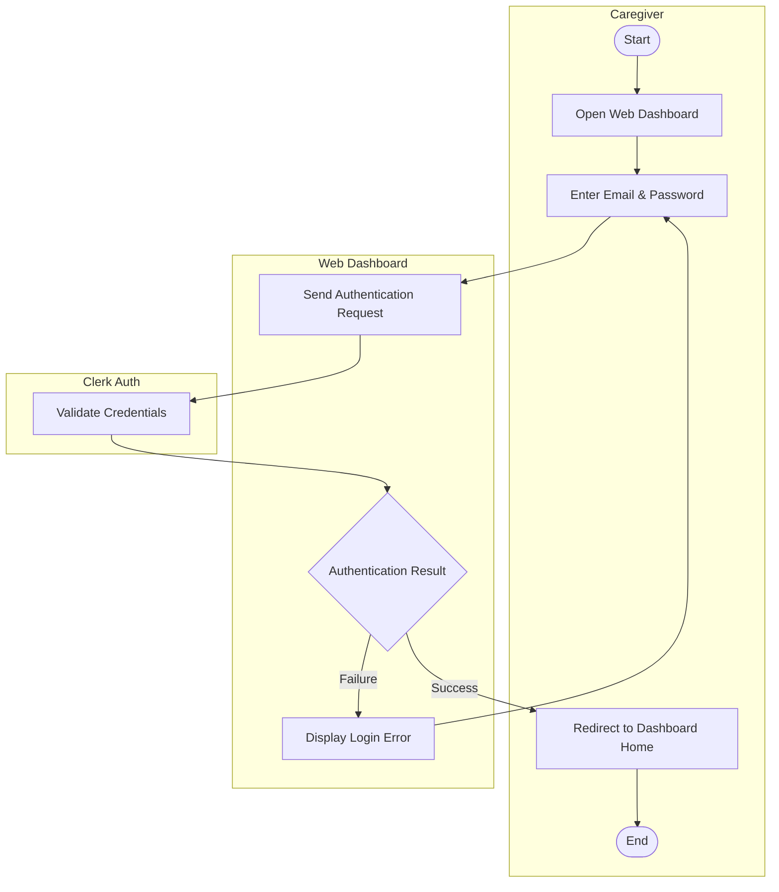
```mermaid
flowchart TD
    subgraph User["Caregiver"]
        Start([Start]) --> OpenWeb[Open Web Dashboard]
        OpenWeb --> InputCreds[Enter Email & Password]
        ViewHome[Redirect to Dashboard Home] --> End([End])
    end

    subgraph Dashboard["Web Dashboard"]
        InputCreds --> RequestAuth[Send Authentication Request]
        ShowError[Display Login Error] --> InputCreds
        AuthSuccess{Authentication Result} -- Success --> ViewHome
        AuthSuccess -- Failure --> ShowError
    end

    subgraph Clerk["Clerk Auth"]
        RequestAuth --> VerifyCredentials[Validate Credentials]
        VerifyCredentials --> AuthSuccess
    end
```

---

#### 3.6.3.2 UC02 - Register Account Activity Diagram

This diagram maps the workflow to create a new caregiver account profile.

*Figure 3.2: Register Account Activity Diagram*
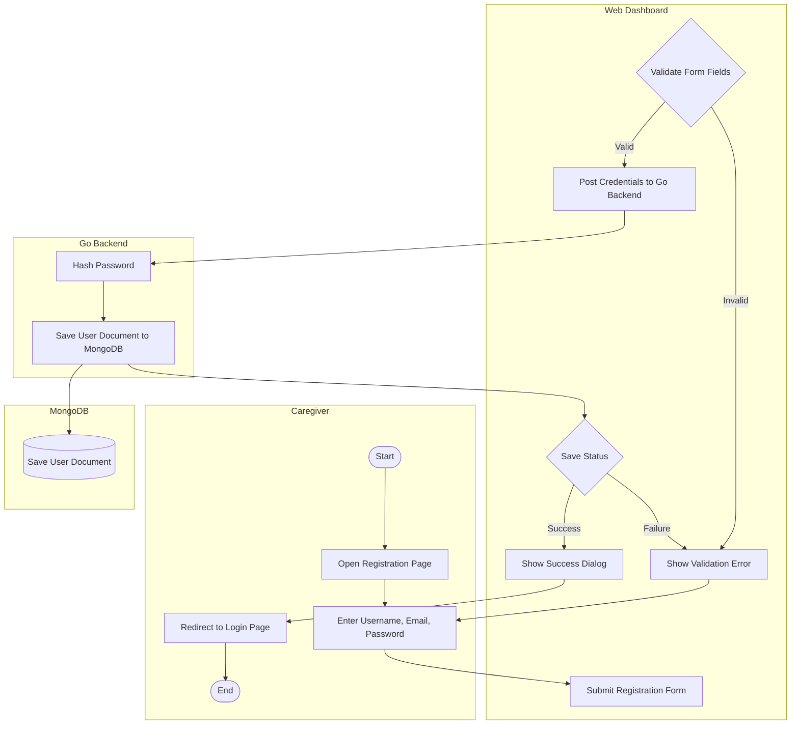
```mermaid
flowchart TD
    subgraph User["Caregiver"]
        Start([Start]) --> OpenReg[Open Registration Page]
        OpenReg --> InputReg[Enter Username, Email, Password]
        ViewLogin[Redirect to Login Page] --> End([End])
    end

    subgraph Dashboard["Web Dashboard"]
        InputReg --> SubmitReg[Submit Registration Form]
        ValidateInput{Validate Form Fields}
        ValidateInput -- Invalid --> ShowRegError[Show Validation Error] --> InputReg
        ValidateInput -- Valid --> RequestBackend[Post Credentials to Go Backend]
        
        WriteResult{Save Status} -- Success --> ShowRegSuccess[Show Success Dialog]
        ShowRegSuccess --> ViewLogin
        WriteResult -- Failure --> ShowRegError
    end

    subgraph Backend["Go Backend"]
        RequestBackend --> HashPass[Hash Password]
        HashPass --> SaveUser[Save User Document to MongoDB]
        SaveUser --> WriteResult
    end

    subgraph MongoDB
        SaveUser --> WriteDB[(Save User Document)]
    end
```

---

#### 3.6.3.3 UC03 - Configure Patient Health Profile Activity Diagram

This diagram describes configuring and indexing the patient's health parameters and contacts.

*Figure 3.3: Configure Patient Profile Activity Diagram*
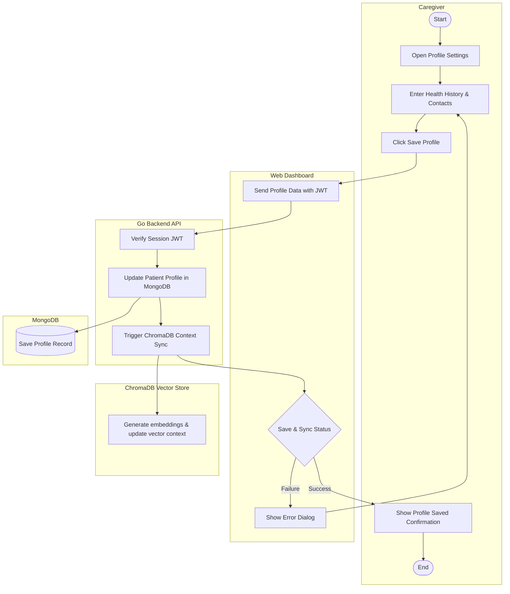
```mermaid
flowchart TD
    subgraph User["Caregiver"]
        Start([Start]) --> OpenSettings[Open Profile Settings]
        OpenSettings --> InputProfile[Enter Health History & Contacts]
        InputProfile --> SaveProfile[Click Save Profile]
        ShowConfirm[Show Profile Saved Confirmation] --> End([End])
    end

    subgraph Dashboard["Web Dashboard"]
        SaveProfile --> PostProfile[Send Profile Data with JWT]
        SyncResult{Save & Sync Status} -- Success --> ShowConfirm
        SyncResult -- Failure --> ShowProfileError[Show Error Dialog] --> InputProfile
    end

    subgraph Backend["Go Backend API"]
        PostProfile --> CheckAuth[Verify Session JWT]
        CheckAuth --> SaveDB[Update Patient Profile in MongoDB]
        SaveDB --> SyncChroma[Trigger ChromaDB Context Sync]
        SyncChroma --> SyncResult
    end

    subgraph DB["MongoDB"]
        SaveDB --> SaveProfileDB[(Save Profile Record)]
    end

    subgraph Chroma["ChromaDB Vector Store"]
        SyncChroma --> IndexContext[Generate embeddings & update vector context]
    end
```

---

#### 3.6.3.4 UC04 - Add Camera Activity Diagram

This diagram outlines adding a new RTSP camera node and initiating HLS transcoding.

*Figure 3.4: Add Camera Activity Diagram*
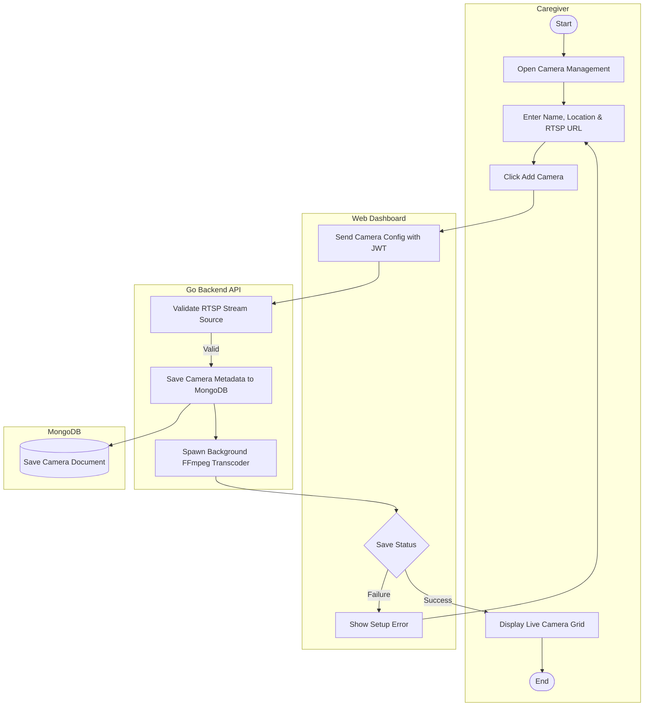
```mermaid
flowchart TD
    subgraph User["Caregiver"]
        Start([Start]) --> OpenCamMgr[Open Camera Management]
        OpenCamMgr --> InputCam[Enter Name, Location & RTSP URL]
        InputCam --> AddCam[Click Add Camera]
        ViewCamFeed[Display Live Camera Grid] --> End([End])
    end

    subgraph Dashboard["Web Dashboard"]
        AddCam --> PostCamera[Send Camera Config with JWT]
        PostResult{Save Status} -- Success --> ViewCamFeed
        PostResult -- Failure --> ShowCamError[Show Setup Error] --> InputCam
    end

    subgraph Backend["Go Backend API"]
        PostCamera --> ValidateRTSP[Validate RTSP Stream Source]
        ValidateRTSP -- Valid --> SaveCamDB[Save Camera Metadata to MongoDB]
        SaveCamDB --> SpawnFFmpeg[Spawn Background FFmpeg Transcoder]
        SpawnFFmpeg --> PostResult
    end

    subgraph DB["MongoDB"]
        SaveCamDB --> SaveCam[(Save Camera Document)]
    end
```

---

#### 3.6.3.5 UC08 - View Live HLS Stream Activity Diagram

This diagram maps authentication check and segments transfer during live playback.

*Figure 3.5: View Live HLS Stream Activity Diagram*
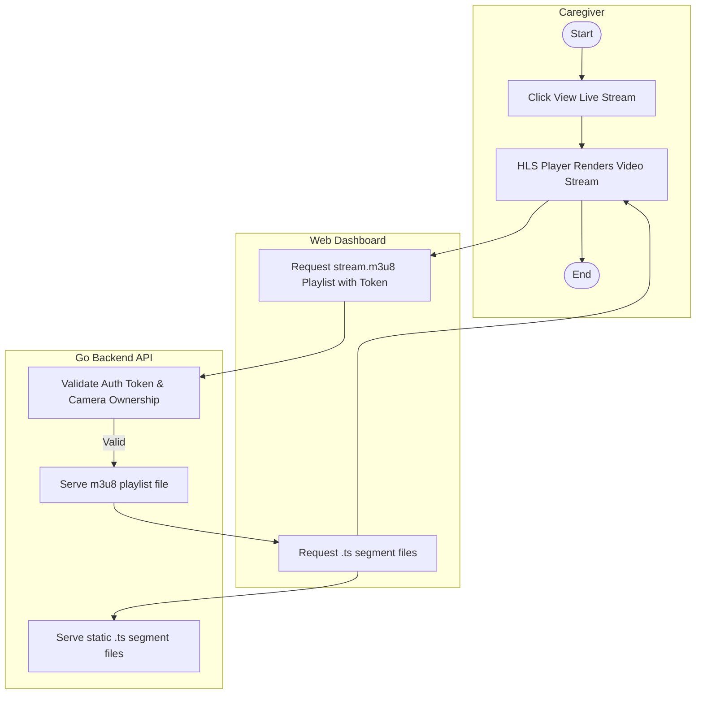
```mermaid
flowchart TD
    subgraph User["Caregiver"]
        Start([Start]) --> OpenLive[Click View Live Stream]
        OpenLive --> StreamPlay[HLS Player Renders Video Stream] --> End([End])
    end

    subgraph Dashboard["Web Dashboard"]
        StreamPlay --> RequestManifest[Request stream.m3u8 Playlist with Token]
        RequestSegments[Request .ts segment files] --> StreamPlay
    end

    subgraph Backend["Go Backend API"]
        RequestManifest --> ValToken[Validate Auth Token & Camera Ownership]
        ValToken -- Valid --> ServeManifest[Serve m3u8 playlist file] --> RequestSegments
        RequestSegments --> ServeSegments[Serve static .ts segment files]
    end
```

---

#### 3.6.3.6 UC09 - Real-time Posture Analysis Activity Diagram

This diagram traces pipeline steps from video capture to database status logging.

*Figure 3.6: Real-time Posture Analysis Activity Diagram*
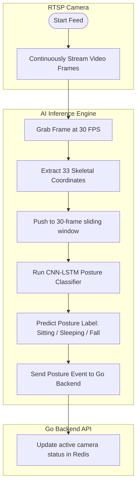
```mermaid
flowchart TD
    subgraph Camera["RTSP Camera"]
        Start([Start Feed]) --> StreamFrames[Continuously Stream Video Frames]
    end

    subgraph Inference["AI Inference Engine"]
        StreamFrames --> GrabFrame[Grab Frame at 30 FPS]
        GrabFrame --> RunMediaPipe[Extract 33 Skeletal Coordinates]
        RunMediaPipe --> BufferCoords[Push to 30-frame sliding window]
        BufferCoords --> RunModel[Run CNN-LSTM Posture Classifier]
        RunModel --> PredictPosture[Predict Posture Label: Sitting / Sleeping / Fall]
        PredictPosture --> PostStatus[Send Posture Event to Go Backend]
    end

    subgraph Backend["Go Backend API"]
        PostStatus --> LogStatus[Update active camera status in Redis]
    end
```

---

#### 3.6.3.7 UC10 - Instant Fall Detection Activity Diagram

This diagram details instant threshold calculations in case of rapid spine angle change.

*Figure 3.7: Instant Fall Detection Activity Diagram*
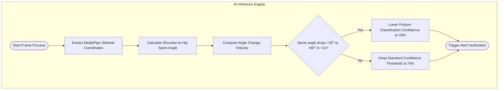
```mermaid
flowchart TD
    subgraph Inference["AI Inference Engine"]
        Start([Start Frame Process]) --> GetCoordinates[Extract MediaPipe Skeletal Coordinates]
        GetCoordinates --> CalcSpine[Calculate Shoulder-to-Hip Spine Angle]
        CalcSpine --> CalcSpeed[Compute Angle Change Velocity]
        
        CalcSpeed --> CheckDrop{Spine angle drops <25° to >60° in <1s?}
        CheckDrop -- Yes --> SetThreshold[Lower Posture Classification Confidence to 40%]
        CheckDrop -- No --> KeepThreshold[Keep Standard Confidence Threshold at 70%]
        
        SetThreshold --> End([Trigger Alert Verification])
        KeepThreshold --> End
    end
```

---

#### 3.6.3.8 UC11 - Suppress False Alarms Activity Diagram

This diagram outlines check overlap details against YOLOv11 bounding boxes of furniture.

*Figure 3.8: Suppress False Alarms Activity Diagram*
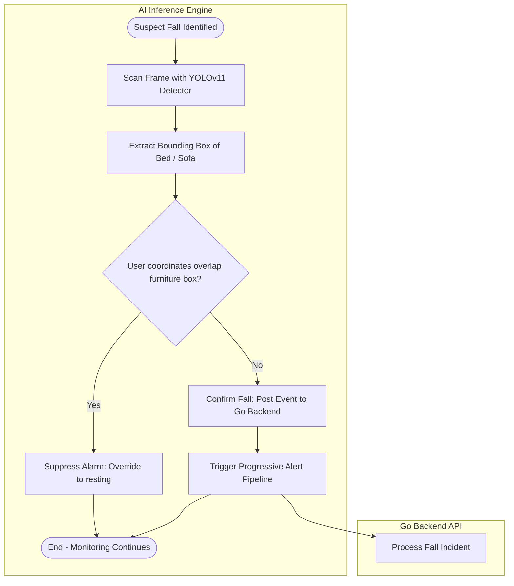
```mermaid
flowchart TD
    subgraph Inference["AI Inference Engine"]
        Start([Suspect Fall Identified]) --> ScanYOLO[Scan Frame with YOLOv11 Detector]
        ScanYOLO --> DetectFurniture[Extract Bounding Box of Bed / Sofa]
        DetectFurniture --> CheckOverlap{User coordinates overlap furniture box?}
        
        CheckOverlap -- Yes --> Suppress[Suppress Alarm: Override to resting]
        CheckOverlap -- No --> Confirm[Confirm Fall: Post Event to Go Backend]
        
        Suppress --> End([End - Monitoring Continues])
        Confirm --> PostAlert[Trigger Progressive Alert Pipeline] --> End
    end

    subgraph Backend["Go Backend API"]
        PostAlert --> RecvFall[Process Fall Incident]
    end
```

---

#### 3.6.3.9 UC12 - Trigger Local Audio Warning Activity Diagram

This diagram illustrates local warning announcements and suspect timers in the backend.

*Figure 3.9: Trigger Local Warning Activity Diagram*
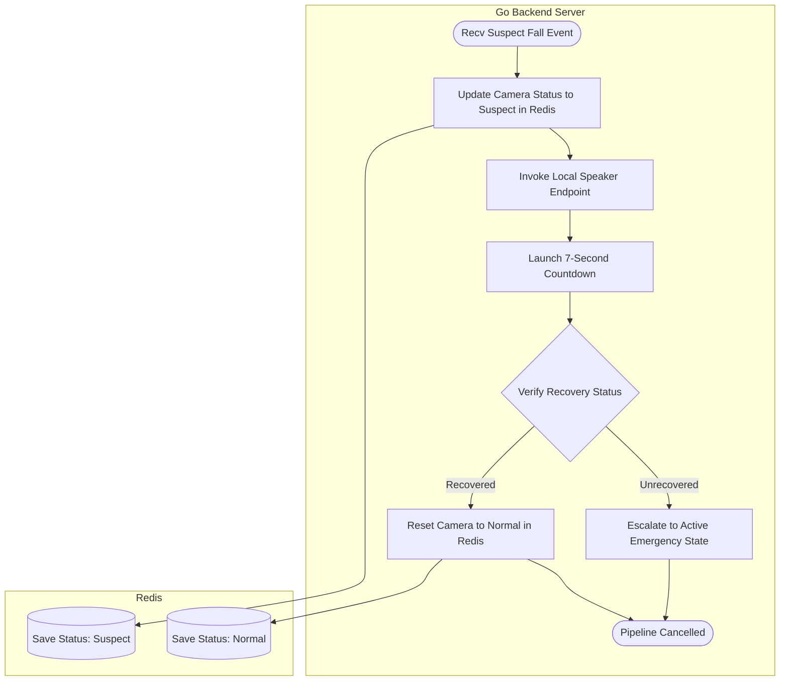
```mermaid
flowchart TD
    subgraph Backend["Go Backend Server"]
        Start([Recv Suspect Fall Event]) --> SetRedis[Update Camera Status to Suspect in Redis]
        SetRedis --> TriggerAudio[Invoke Local Speaker Endpoint]
        TriggerAudio --> StartTimer[Launch 7-Second Countdown]
        
        StartTimer --> CheckRecovery{Verify Recovery Status}
        CheckRecovery -- Recovered --> ResetCache[Reset Camera to Normal in Redis] --> End([Pipeline Cancelled])
        CheckRecovery -- Unrecovered --> ActiveAlert[Escalate to Active Emergency State] --> End
    end

    subgraph Redis
        SetRedis --> RedisSuspect[(Save Status: Suspect)]
        ResetCache --> RedisNormal[(Save Status: Normal)]
    end
```

---

#### 3.6.3.10 UC13 - Trigger Web Flashing Alert Activity Diagram

This diagram maps the WebSocket broadcast that signals active warnings on the UI.

*Figure 3.10: Trigger Web Flashing Alert Activity Diagram*
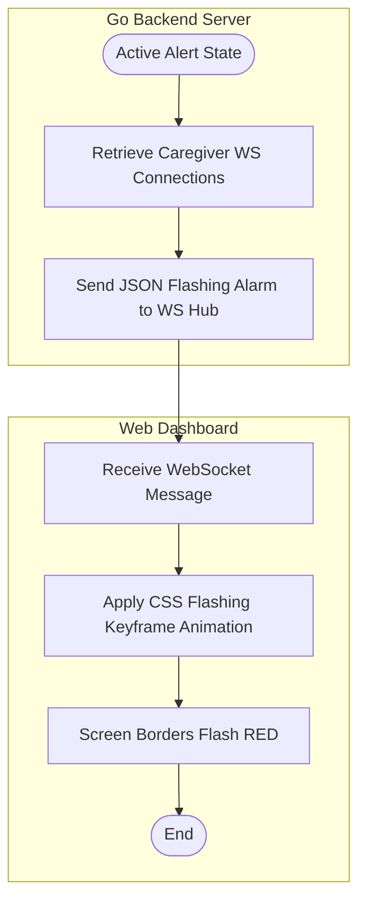
```mermaid
flowchart TD
    subgraph Backend["Go Backend Server"]
        Start([Active Alert State]) --> FetchConns[Retrieve Caregiver WS Connections]
        FetchConns --> BroadcastWS[Send JSON Flashing Alarm to WS Hub]
    end

    subgraph Dashboard["Web Dashboard"]
        BroadcastWS --> RecvWS[Receive WebSocket Message]
        RecvWS --> ToggleCSS[Apply CSS Flashing Keyframe Animation]
        ToggleCSS --> FlashScreen[Screen Borders Flash RED] --> End([End])
    end
```

---

#### 3.6.3.11 UC14 - Send Telegram Alert with Evidence Activity Diagram

This diagram outlines image retrieval and payload packaging for Telegram endpoints.

*Figure 3.11: Send Telegram Alert Activity Diagram*
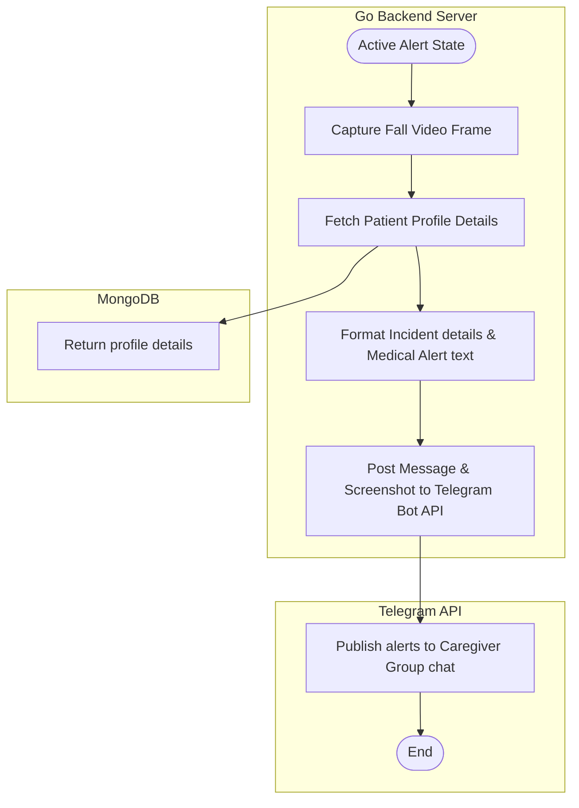
```mermaid
flowchart TD
    subgraph Backend["Go Backend Server"]
        Start([Active Alert State]) --> CaptureFrame[Capture Fall Video Frame]
        CaptureFrame --> QueryMongo[Fetch Patient Profile Details]
        QueryMongo --> BuildMessage[Format Incident details & Medical Alert text]
        BuildMessage --> SendBotAPI[Post Message & Screenshot to Telegram Bot API]
    end

    subgraph DB["MongoDB"]
        QueryMongo --> MongoProfile[Return profile details]
    end

    subgraph Telegram["Telegram API"]
        SendBotAPI --> PostGroup[Publish alerts to Caregiver Group chat] --> End([End])
    end
```

---

#### 3.6.3.12 UC15 - Place Emergency Phone Call Activity Diagram

This diagram describes call dialing retries and text-to-speech feedback via Twilio.

*Figure 3.12: Place Emergency Phone Call Activity Diagram*
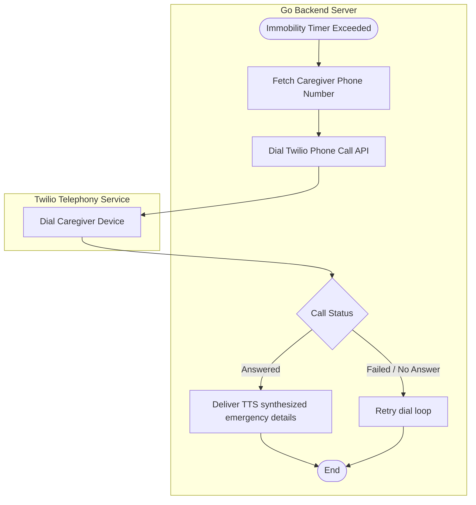
```mermaid
flowchart TD
    subgraph Backend["Go Backend Server"]
        Start([Immobility Timer Exceeded]) --> FetchNumber[Fetch Caregiver Phone Number]
        FetchNumber --> PostTwilio[Dial Twilio Phone Call API]
        AnswerCall{Call Status} -- Answered --> PlayTTS[Deliver TTS synthesized emergency details] --> End([End])
        AnswerCall -- Failed / No Answer --> RetryCall[Retry dial loop] --> End
    end

    subgraph Twilio["Twilio Telephony Service"]
        PostTwilio --> DialPhone[Dial Caregiver Device]
        DialPhone --> AnswerCall
    end
```

---

#### 3.6.3.13 UC16 - Archive Incident Video Activity Diagram

This diagram describes local segment copies to long-term database endpoints.

*Figure 3.13: Archive Incident Video Activity Diagram*
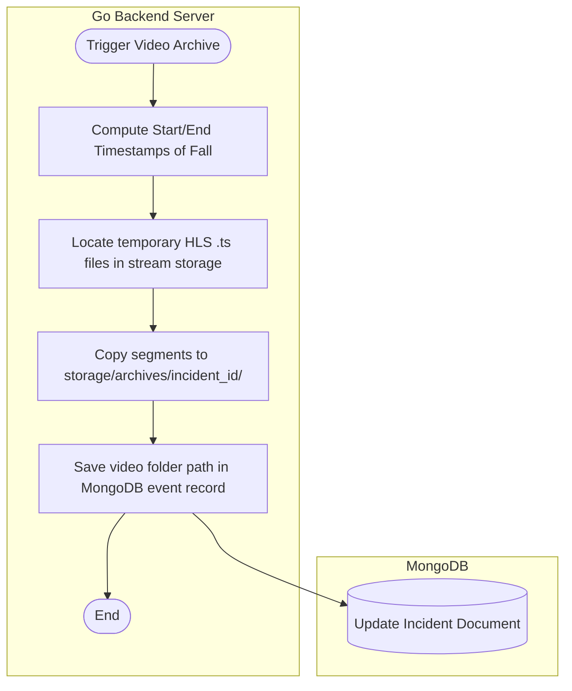
```mermaid
flowchart TD
    subgraph Backend["Go Backend Server"]
        Start([Trigger Video Archive]) --> CalcTime[Compute Start/End Timestamps of Fall]
        CalcTime --> ReadSegments[Locate temporary HLS .ts files in stream storage]
        ReadSegments --> CopyFiles[Copy segments to storage/archives/incident_id/]
        CopyFiles --> UpdateMongo[Save video folder path in MongoDB event record] --> End([End])
    end

    subgraph DB["MongoDB"]
        UpdateMongo --> MongoSave[(Update Incident Document)]
    end
```

---

#### 3.6.3.14 UC17 - Acknowledge/Deactivate Alert Activity Diagram

This diagram maps click notifications and active cancel routes in the dashboard.

*Figure 3.14: Acknowledge Alert Activity Diagram*
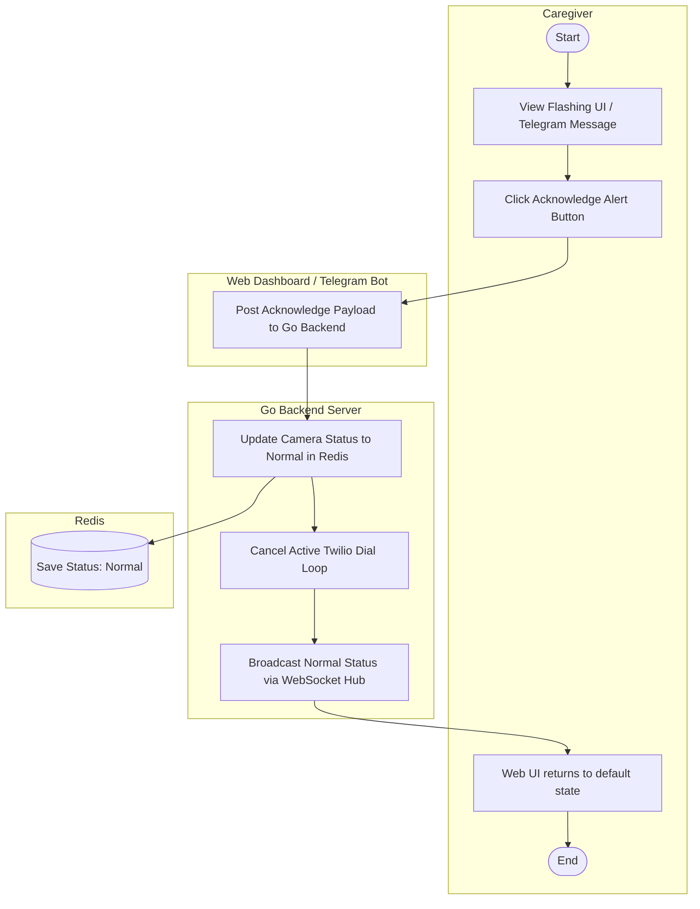
```mermaid
flowchart TD
    subgraph User["Caregiver"]
        Start([Start]) --> OpenAlert[View Flashing UI / Telegram Message]
        OpenAlert --> ClickAck[Click Acknowledge Alert Button]
        ViewNormalUI[Web UI returns to default state] --> End([End])
    end

    subgraph Dashboard["Web Dashboard / Telegram Bot"]
        ClickAck --> PostAck[Post Acknowledge Payload to Go Backend]
    end

    subgraph Backend["Go Backend Server"]
        PostAck --> ResetRedis[Update Camera Status to Normal in Redis]
        ResetRedis --> StopTwilio[Cancel Active Twilio Dial Loop]
        StopTwilio --> BroadcastNormal[Broadcast Normal Status via WebSocket Hub]
        BroadcastNormal --> ViewNormalUI
    end

    subgraph Redis
        ResetRedis --> SaveNormal[(Save Status: Normal)]
    end
```

---

#### 3.6.3.15 UC19 - Query CPR & Medical Guidelines Activity Diagram

This diagram describes the RAG flow traversing local contexts and the Gemini API.

*Figure 3.15: Query CPR Guidelines Activity Diagram*
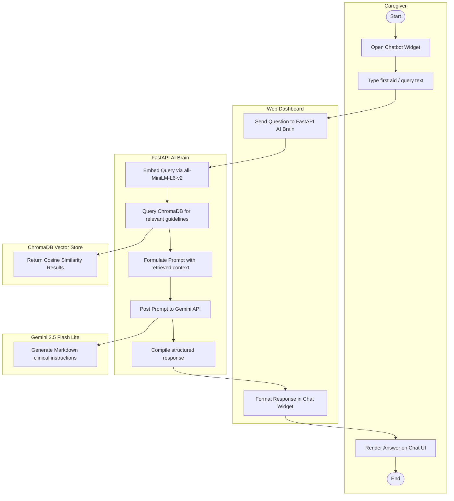
```mermaid
flowchart TD
    subgraph User["Caregiver"]
        Start([Start]) --> OpenChat[Open Chatbot Widget]
        OpenChat --> InputQuery[Type first aid / query text]
        ViewAnswer[Render Answer on Chat UI] --> End([End])
    end

    subgraph Dashboard["Web Dashboard"]
        InputQuery --> PostAIQuery[Send Question to FastAPI AI Brain]
        ReceiveResult[Format Response in Chat Widget] --> ViewAnswer
    end

    subgraph AIBrain["FastAPI AI Brain"]
        PostAIQuery --> GenEmbed[Embed Query via all-MiniLM-L6-v2]
        GenEmbed --> SearchVector[Query ChromaDB for relevant guidelines]
        SearchVector --> BuildPrompt[Formulate Prompt with retrieved context]
        BuildPrompt --> CallGemini[Post Prompt to Gemini API]
        CallGemini --> FormatMarkdown[Compile structured response]
        FormatMarkdown --> ReceiveResult
    end

    subgraph Chroma["ChromaDB Vector Store"]
        SearchVector --> FetchDocuments[Return Cosine Similarity Results]
    end

    subgraph Gemini["Gemini 2.5 Flash Lite"]
        CallGemini --> GenerateText[Generate Markdown clinical instructions]
    end
```

---

#### 3.6.3.16 UC24 - Remote Heart Rate Monitoring (rPPG) Activity Diagram

This diagram details filter applications and frequency calculations for vital statistics.

*Figure 3.16: Remote Heart Rate Monitoring Activity Diagram*
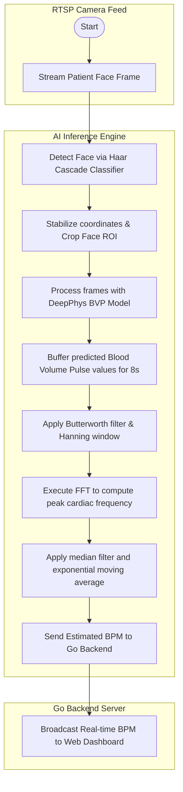
```mermaid
flowchart TD
    subgraph Camera["RTSP Camera Feed"]
        Start([Start]) --> StreamFace[Stream Patient Face Frame]
    end

    subgraph Inference["AI Inference Engine"]
        StreamFace --> DetectFace[Detect Face via Haar Cascade Classifier]
        DetectFace --> StabilizeROI[Stabilize coordinates & Crop Face ROI]
        StabilizeROI --> DeepPhys[Process frames with DeepPhys BVP Model]
        DeepPhys --> BufferBVP[Buffer predicted Blood Volume Pulse values for 8s]
        BufferBVP --> FilterSignal[Apply Butterworth filter & Hanning window]
        FilterSignal --> RunFFT[Execute FFT to compute peak cardiac frequency]
        RunFFT --> MedianFilter[Apply median filter and exponential moving average]
        MedianFilter --> PostHeartRate[Send Estimated BPM to Go Backend]
    end

    subgraph Backend["Go Backend Server"]
        PostHeartRate --> BroadcastVitals[Broadcast Real-time BPM to Web Dashboard]
    end
```

---

#### 3.6.3.17 UC25 - Remote Respiration Rate Monitoring Activity Diagram

This diagram charts average luminance fluctuations and chest ROI detection details.

*Figure 3.17: Remote Respiration Rate Monitoring Activity Diagram*
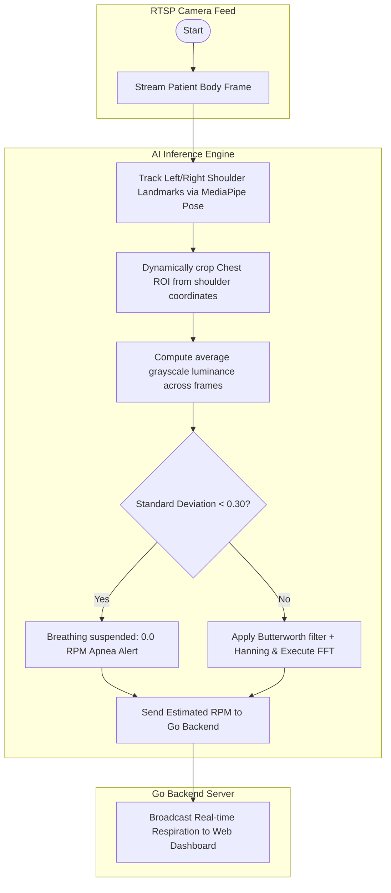
```mermaid
flowchart TD
    subgraph Camera["RTSP Camera Feed"]
        Start([Start]) --> StreamChest[Stream Patient Body Frame]
    end

    subgraph Inference["AI Inference Engine"]
        StreamChest --> RunPose[Track Left/Right Shoulder Landmarks via MediaPipe Pose]
        RunPose --> CropChest[Dynamically crop Chest ROI from shoulder coordinates]
        CropChest --> CalcLuminance[Compute average grayscale luminance across frames]
        CalcLuminance --> CheckApnea{Standard Deviation < 0.30?}
        
        CheckApnea -- Yes --> SetApnea[Breathing suspended: 0.0 RPM Apnea Alert]
        CheckApnea -- No --> RunRespirationFFT[Apply Butterworth filter + Hanning & Execute FFT]
        
        SetApnea --> PostRPM
        RunRespirationFFT --> PostRPM[Send Estimated RPM to Go Backend]
    end

    subgraph Backend["Go Backend Server"]
        PostRPM --> BroadcastVitalsRR[Broadcast Real-time Respiration to Web Dashboard]
    end
```

---

#### 3.6.3.18 UC26 - Facial Pain Expression Detection Activity Diagram

This diagram diagrams facial mesh calculations and threshold updates for strokes alert.

*Figure 3.18: Facial Pain Expression Detection Activity Diagram*
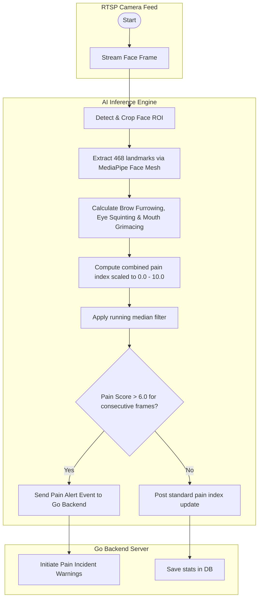
```mermaid
flowchart TD
    subgraph Camera["RTSP Camera Feed"]
        Start([Start]) --> StreamFace[Stream Face Frame]
    end

    subgraph Inference["AI Inference Engine"]
        StreamFace --> CropFace[Detect & Crop Face ROI]
        CropFace --> FaceMesh[Extract 468 landmarks via MediaPipe Face Mesh]
        FaceMesh --> CalcFeatures[Calculate Brow Furrowing, Eye Squinting & Mouth Grimacing]
        CalcFeatures --> CalcPain[Compute combined pain index scaled to 0.0 - 10.0]
        CalcPain --> FilterPain[Apply running median filter]
        FilterPain --> CheckPain{Pain Score > 6.0 for consecutive frames?}
        CheckPain -- Yes --> PostPainAlert[Send Pain Alert Event to Go Backend]
        CheckPain -- No --> PostNormalPain[Post standard pain index update]
    end

    subgraph Backend["Go Backend Server"]
        PostPainAlert --> TriggerAlarmPipeline[Initiate Pain Incident Warnings]
        PostNormalPain --> LogPainStats[Save stats in DB]
    end
```

---

#### 3.6.3.19 UC27 - Bedside Monitor Environment Diagnostics Activity Diagram

This diagram charts lighting stats calculations and warnings updates on ports.

*Figure 3.19: Bedside Monitor Diagnostics Activity Diagram*
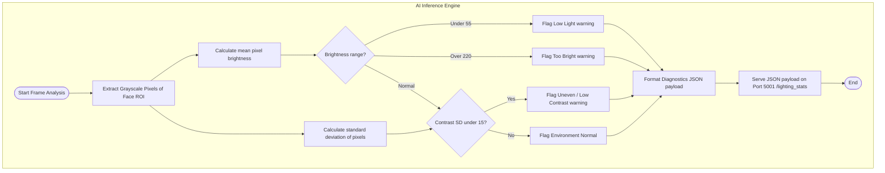
```mermaid
flowchart TD
    subgraph Inference["AI Inference Engine"]
        Start([Start Frame Analysis]) --> Grayscale[Extract Grayscale Pixels of Face ROI]
        Grayscale --> CalcBrightness[Calculate mean pixel brightness]
        Grayscale --> CalcContrast[Calculate standard deviation of pixels]
        
        CalcBrightness --> CheckBrightness{Brightness range?}
        CheckBrightness -- Under 55 --> AlertLowLight[Flag Low Light warning]
        CheckBrightness -- Over 220 --> AlertHighLight[Flag Too Bright warning]
        CheckBrightness -- Normal --> ContrastCheck
        
        CalcContrast --> ContrastCheck{Contrast SD under 15?}
        ContrastCheck -- Yes --> AlertLowContrast[Flag Uneven / Low Contrast warning]
        ContrastCheck -- No --> OutputOK[Flag Environment Normal]
        
        AlertLowLight --> CompileStats
        AlertHighLight --> CompileStats
        AlertLowContrast --> CompileStats
        OutputOK --> CompileStats[Format Diagnostics JSON payload]
        CompileStats --> ServeEndpoint[Serve JSON payload on Port 5001 /lighting_stats] --> End([End])
    end
```

